## IP / MAC / port
 - IP -> to identify the network of destination device
  - MAC -> to identify the destination device.
  - Port -> To identify the process in the device

## **What Really Happens When You Make an HTTP Request?**
When you make an HTTP request, a series of steps occur behind the scenes to facilitate communication between your client (like a web browser or application) and the server hosting the resource you're trying to access. Here's a breakdown of what happens:

```text
Domain → IP → HTTP Data → TCP Segment → IP Packet → Frame → Network → Server
```

* **DNS** converts the domain name (e.g., `www.example.com`) into the server's **IP address (destination IP)**. For example, this could be the public IP address of an AWS EC2 instance or, more commonly, a load balancer/reverse proxy in front of it.

* The browser creates the **HTTP request** as data (text/bytes). HTTP itself is ultimately transmitted as bytes over the network.

* The browser asks the **operating system's networking stack** to send the request to the destination IP address.

* For **TCP-based HTTP**, the operating system establishes a TCP connection with the server using the **three-way handshake** (`SYN → SYN-ACK → ACK`). This ensures that both sides are ready to communicate.

* Once the TCP connection is established, the HTTP request data is passed to **TCP**. TCP divides the data into smaller pieces when necessary and adds a **TCP header** to each piece, creating **TCP segments**.

* The TCP header contains information such as the **source port** and **destination port**. The source port is usually a temporary (ephemeral) port chosen by the client, while the destination port is typically **80 for HTTP** or **443 for HTTPS**.

* Each TCP segment is passed to **IP**, which adds an **IP header** containing the **source IP address** and **destination IP address**. This creates an **IP packet**.

* The IP packet is then passed to the **Data Link layer**, which adds a frame header/trailer containing the **source and destination MAC addresses** (for Ethernet/Wi-Fi). This creates a **frame**. 

* The frame is transmitted over the physical network, such as **Wi-Fi or an Ethernet cable**, to the next network device (usually the client's router/default gateway).

* The frame may pass through **multiple routers and networks** before reaching the destination network. The IP source and destination generally remain the same end-to-end, while the **MAC addresses change at each local network hop**.

* When the server receives the frame, its network interface removes the Data Link layer information and passes the **IP packet** to the IP layer.

* The IP layer removes the IP header and passes the **TCP segment** to TCP.

* TCP uses the **sequence numbers** in the segments to put the data back in the correct order, handles retransmission if necessary, and delivers the reconstructed HTTP request data to the application (such as a web server).

* The web server/application processes the HTTP request, performs the required work, and generates an **HTTP response**, such as an HTML page or JSON data.

* The HTTP response travels back to the client through the same general layering process in reverse: **HTTP data → TCP segment → IP packet → Data Link frame → network → client**.

<br>

## **IP or logical Address**
- An IP address is a unique identifier assigned to each device connected to a network. 
- Assigned by `ISP`(Internet Service Provider) or network administrator.
- It serves two main purposes: 
  - identifying the host or network interface 
  - providing the location of the host in the network
- There are two versions of IP addresses: `IPv4` and `IPv6`.
  - `IPv4` addresses are 4-byte numbers typically represented in decimal format as four octets separated by periods (e.g., 192.168.1.1). 8 bits per octet. Each octet can range from 0 to 255, allowing for a total of approximately 4.3 billion unique addresses.
  - `IPv6` addresses are 128-bit numbers typically represented in hexadecimal format as eight groups of four hexadecimal digits separated by colons (e.g., 2001:0db8:85a3:0000:0000:8a2e:0370:7334). 
- Starting few bits of the IP address are used to identify the network, while the remaining bits are used to identify the host within that network. 

### Public & Private IP Address
- **Public IP** addresses are assigned to devices that are directly accessible from the internet. They are unique across the entire internet and are used for communication between devices on different networks. Public IP addresses are typically assigned by Internet Service Providers (ISPs) and can be either static (permanent) or dynamic (changing over time).
- **Private IP** addresses are used within private networks (like home or office networks). Assigned by the routers.


### Host
- A host is any device that has an IP address and can send or receive data over a network. This includes computers, servers, smartphones, and other devices connected to the internet.

<br>

## **Network**
- A network is a collection of interconnected devices that can communicate with each other. Suppose I have a mobile,laptop,computer connected to a router & router is connected to the internet. These connected devices form a network.

- Each network has a IP address which is helpful in deciding whether the destination device is in the same network or not.

- Within same network, devices can communicate directly with each other using their IP addresses without any internet. 

- If the destination device is in a different network, the request must be routed through a gateway or router to reach the destination.

- Router uses DHCP(Dynamic Host Configuration Protocol) to assign IP addresses to devices connected to it. 

- CIDR notation is a compact representation of an IP address and its associated network mask. It consists of the IP address, followed by a slash ('/') and a number(32 bit) which indicates the number of bits reserved for the network. Every device in the network has same first (number of bits) in their IP address. Remaining bits are used for host addresses within the network. 

<br>

## **Types of Networks**
- There are several types of networks, based on their scope and coverage:
  - **Personal Area Network (PAN):** A network that is used for communication among devices close to one person. Example: Bluetooth connection between a smartphone and a wireless headset.
  - **Local Area Network (LAN):** A network that covers a small geographic area, such as a home, office, or building. LANs are typically used for connecting devices within a limited area. Example: Home Wi-Fi network, Office network.
  - **Campus Area Network (CAN):** A network that connects devices within a limited geographic area, such as a university campus or a corporate campus.
  - **Metropolitan Area Network (MAN):** A network that covers a larger geographic area than a LAN but smaller than a WAN, typically spanning a city or metropolitan area. 
  - **Wide Area Network (WAN):** A network that covers a large geographic area, such as a city, country, or even the entire world. The internet is an example of a WAN. 

<br>

## **Subnet**
- A subnet (short for "subnetwork") is a smaller network within a larger network.
- It is created by dividing a larger network into smaller, more manageable segments. Subnets are used to improve network performance, enhance security, and simplify network management.
- Each subnet has its own unique network address and can contain multiple hosts (devices) within it. The subnet mask is used to determine which portion of an IP address represents the network and which portion represents the host within that network.

<br>

## **Subnet Mask**
- A subnet mask is a 32-bit number that divides an IP address into network and host portions. It helps determine which part of the IP address identifies the network and which part identifies the host within that network.
- It helps devices in determining whether a destination device is in the same network or not.
  - How it does:-
    - First, the device performs a bitwise AND operation between its own IP address and the subnet mask to determine its network address.
    - Then, it performs the same operation with the destination IP address and the subnet mask to determine the destination network address.
    - If the two network addresses match, the destination device is in the same network; otherwise, it is in a different network.

- For example, a subnet mask of 255.255.255.0 (or /24 in CIDR notation) indicates that the first 24 bits are used for the network portion, and the remaining 8 bits are used for the host portion.


<br>

## **Default Gateway**
- A default gateway is a device (usually a router) that knows how to connect with outside networks. 
- Acts as a mediator for sending data from a device in one network to a device in another network.
- A single gateway can connect multiple networks, allowing devices in different networks to communicate with each other.

<br>

## **MAC / Physical Address**
- A MAC (Media Access Control) address is a unique identifier assigned to a network interface card (NIC) for communication over the internet.
- Assigned by manufacturer & is unique for every device.  - It is a `6-byte` address typically represented in hexadecimal format (e.g., 00:1A:2B:3C:4D:5E).
- Each byte of the MAC address is represented by two hexadecimal digits & two digits separated by colons or hyphens.
- First 3 bytes of the MAC address represent the Organizationally Unique Identifier (OUI), which identifies the manufacturer(company) of the device. The remaining 3 bytes represents unique identity of the device.

<br>

## **IP vs MAC Address**

 IP Address | MAC Address |
------------|-------------|
 32 bits (IPv4) or 128 bits (IPv6) | 48 bits |
 Assigned by ISP or network administrator | Assigned by manufacturer |
 Can change over time (dynamic) | Permanent and unique to the device |
 Data ko internet/outer network me sahi router/destination tak routing karna | Data ko local network me sahi device tak pahuchana |

<br>

## **ARP (Address Resolution Protocol)**
- ARP is a protocol used to convert an IP address to its respective MAC address within a local network. When a device wants to communicate with another device on the same network, it needs to know the MAC address associated with the destination IP address.
- The ARP process works as follows: 
  1. The device sends an ARP request, which is a broadcast message(done by the Router) asking "Who has this IP address from every other devices in the network? Please send me your MAC address."
  2. The device with the matching IP address responds with its MAC address.
  3. The requesting device receives the MAC address(through requested device via router) and can now communicate directly with the destination device using its MAC address.
- Every device maintains an ARP table, which is a cache that stores recently resolved IP-to-MAC address mappings, allowing devices to quickly look up MAC addresses without sending ARP requests for every communication.
 
<br>

## **OSI Model**
- Introduced by ISO (International Organization for Standardization) in 1984.
- Conceptual model only.
- Stands for Open Systems Interconnection model. 
- Opens system means that the system is open to communicate with other systems. Interconnection means how it's connected over the internet.
- It provides a set of rules & regulations for the communication between different systems over the internet.
- Consists of 7 layers. Each layer serves a specific purpose and communicates with the layers directly above and below it. 
> Andra Pradesh Se Train New Delhi Pahuchi
 
> Pehle dhoni nhi to sachin pehle aayega

  ### Application Layer:
  - provides network services directly to end-user applications, enabling functionalities like email, file transfer, and web browsing through protocols like HTTP, FTP, and SMTP.

  ### Presentation Layer:
  - This layer is responsible for translating data between the application layer and the network format, including data encryption, compression, and formatting.

  ### Session Layer:
  - This layer manages sessions or connections between applications, establishing, maintaining, and terminating communication sessions.

  ### Transport Layer: 
  - This layer ensures end-to-end communication, providing error detection, flow control, and retransmission of lost packets. It includes protocols like TCP and UDP.
  - Data unit is called segment. Segment contains src & dest port, data, checksum for error detection.

  ### Network Layer:
  - responsible for routing packets across different networks, determining the best path for data to travel from source to destination IP address.
  - Data unit is called packet. Packet contains src & dest IP address, TCP segment, TTL (Time To Live) to prevent infinite looping of packets in the network.

  ### Data Link Layer:
  - Responsible for establishing a reliable link between two directly connected nodes, handling error detection and correction, and managing access to the physical medium.
  - MAC address is used.
  - Data unit is called frame. Frame contains src & dest MAC address, IP packet, CRC (Cyclic Redundancy Check) for error detection.

  ### Physical Layer:
  - This layer is responsible for the physical connection between devices, including the transmission of raw binary data over a physical medium (like cables or wireless signals).

  
<br>

## **TCP/IP Protocol**
- Stands for Transmission Control Protocol/Internet Protocol.
- Same as OSI model but with 5 layers. In which it combines the OSI model's Application, Presentation, and Session layers into a single Application layer.
- Practical model.

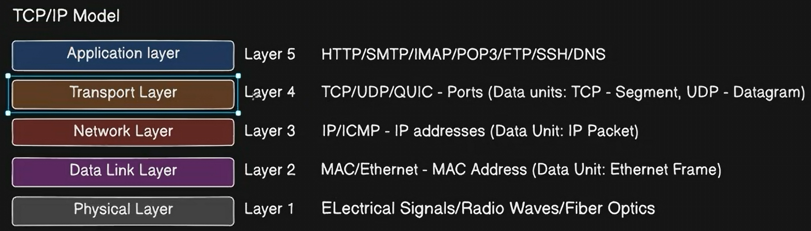


<br>

## **TCP/IP Protocol through http request & http response**
- When you make an HTTP request, the TCP/IP protocol stack is responsible for ensuring that the request is transmitted correctly over the network and that the response is received back from the server. Here's how the TCP/IP protocol works in the context of an HTTP request and response:
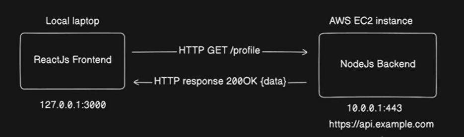
 
### Application Layer:
  - Application layer is responsible for creating the HTTP request. It uses protocols like HTTP or HTTPS to communicate with web servers.

    ``` const res = await fetch("https://api.example.com/profile") ```
  - Presentation layer is responsible for encoding, encrypting, or compressing the HTTP request data into data if necessary. For example, if the request body contains JSON data, it may be serialized into a string format.
  - Session layer manages the session between the client and server. It establishes a session for the HTTP request and maintains it until the response is received.
  
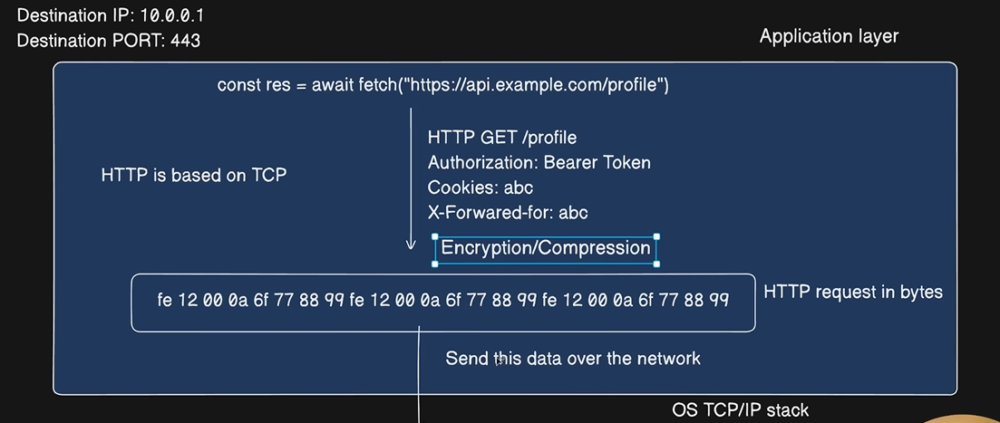

### Transport Layer:
  - The transport layer is responsible for establishing a reliable connection between the client and server. It uses TCP (Transmission Control Protocol) to ensure that the HTTP request is delivered correctly and in order.
  - The HTTP request data is divided into smaller segments, and each segment is assigned a sequence number. TCP ensures that all segments are received and reassembled correctly on the server side.
  - The transport layer also handles error detection and retransmission of lost segments. If any segment is lost during transmission, TCP will request retransmission to ensure data integrity.
  - The transport layer adds a TCP header to each segment, which includes source and destination port numbers, sequence numbers, and other control information.
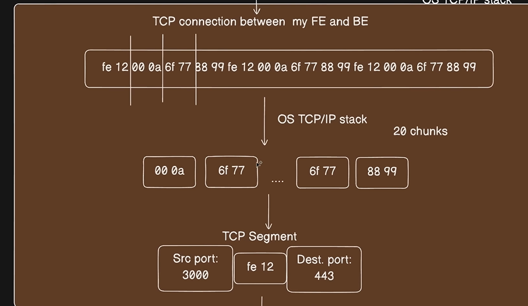

### Network Layer:
  - The network layer is responsible for routing the HTTP request from the client to the server across different networks. It uses IP (Internet Protocol) to determine the best path for the data to travel.
  - Each TCP segment is encapsulated into an IP packet, which includes source and destination IP addresses. The network layer ensures that the packets are delivered to the correct destination.

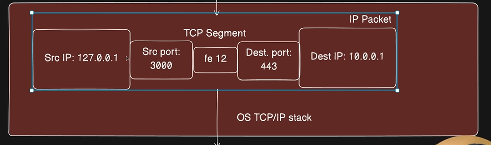

### Data Link Layer:
  - The data link layer is responsible for establishing a reliable link between two directly connected nodes. It handles error detection and correction, as well as managing access to the physical medium.
  - Each IP packet is encapsulated into a frame, which includes source and destination MAC addresses. The data link layer ensures that the frames are delivered to the correct device on the local network.
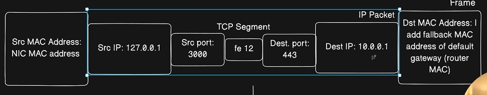

### Physical Layer:
  - The physical layer is responsible for the actual transmission of raw binary data over a physical medium, such as cables or wireless signals. It converts the frames into electrical, optical, or radio signals that can be transmitted over the network.
  - The physical layer ensures that the data is transmitted correctly and efficiently to the next network device.
  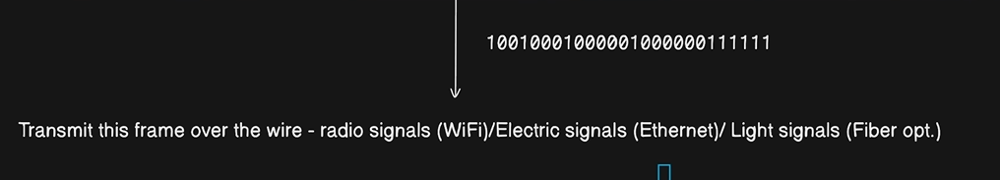


<br>

## **Routing of HTTP Request & Response**
- When you make an HTTP request, the request is routed through various network devices, such as routers and switches, to reach the destination server. The routing process involves determining the best path for the data to travel based on factors like network topology, congestion, and routing protocols.
- The HTTP request is encapsulated into TCP segments, which are then encapsulated into IP packets. Each IP packet is routed independently through the network, and the routing devices use the destination IP address to determine the next hop for each packet.
- Once the HTTP request reaches the destination server, the server processes the request and generates an HTTP response. The response is then routed back to the client using the same process in reverse, ensuring that the data reaches the correct destination.

## Switch & Router
- Router is a layer 3 device used for routing a request based on destination IP
- Switch 2 device used for routing a request based on destination MAC address.

<br>

## **HTTP Request Routing through Switch**
### CASE-1: Send request from `Device A` to `Device D` on the same network
- First `A` will convert domain name to get destination IP.
- Intially a frame will only contain src MAC Address,src IP, data & dst IP.

- First subnetting will happen where `A` check whether `D` belongs to same network or not. here yes.

- After that `A` will a ARP request(What is the MAC of device `D`) to the switch further switch will brodcast it to all other connected devices. Once `D` recieves it will add `A` MAC address in it's ARP table & sends own MAC address to switch & switch will further send it to the `A` & further `A` will add in it's ARP table.

- After that destination MAC  will be attached with the frame.

  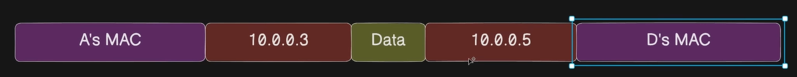

- After that `A` will send the frame to switch & further switch sends it to `D` using it's MAC.


### CASE-2: Send request from Device C to Device X on a different network
- First `A` will convert domain name to get destination IP.
- Intially a frame will only contain src MAC Address,src IP, data & dst IP.

- First subnetting will happen where `C` check whether `X` belongs to same network or not. Here it's not.

- So, `C` will make a ARP request to it's default gateway by first sending it to the switch & then to router(deafult gatway).Once router recieves it will add `C` MAC address in it's ARP table & sends own MAC address to switch & switch will further send it to the `C` & further `C` will add in it's ARP table & add it in the frame as destination MAC.

- After that `C` will send the frame to switch & further switch sends it to router using it's MAC.

- After that router will break the frame & verify whether recieved frame is meant for it only or not. Once MAC get's verified it checks whether destination belongs to any of it's connected network or not(subnetting). Here it belongs. So router will make an ARP request to `X` to get the MAC futher router will add destination MAC it's ARP table, creates a frame & send it to `X`.
  ```
  Source MAC = C's MAC
  Destination MAC = X's MAC
  Source IP = C's IP
  Destination IP = X's IP
  ```


### CASE-3 : Send request from  a device C to remote AWS.
- C first uses DNS to convert the AWS domain name (e.g., example.com) into the destination IP address.

- C uses the subnet mask to check whether the destination IP belongs to the same network. Since AWS is on a different/remote network, it cannot send the frame directly to AWS.

- Therefore, C needs the MAC address of its default gateway (router). For that C sends an ARP Request for the default gateway's IP address.
The switch broadcasts the ARP request, and the router sends back its MAC address.C stores the router's MAC address in its ARP table/cache.
- C creates an Ethernet frame:
  ```
  Source MAC = C's MAC
  Destination MAC = Router's MAC
  Source IP = C's IP
  Destination IP = AWS server's IP
  ```
- C sends the frame to the switch, and the switch forwards it to the router.
- Router breaks the frame & check whether destination MAC is matching with it's MAC or not. Here it matches. After that it will  check whether dest IP belongs to any of it's connected network or not(Using subnetting). Here it will not. So router will send the frame to the internet(ISP) by updating src, dest MAC & src IP.

  For the destination MAC router will send ARP request to all the other routers connected with ISP. 
  ```
  Source MAC = Router MAC
  Destination MAC = Router P MAC
  Source IP = Router's public IP assigned by the ISP(Internet provider)
  Destination IP = AWS server's IP
  ```
-  After that router P will break the frame & apply subnetting on dest IP. Here it does not belongs. So router P will update the src & dest MAC. & sends it to some other router.
- This process will repeat until the frame reaches dest IP. 

<br>

## **ICMP(Internet Control Message Protocol)**
- Protocols which helps in notifying some event(errors) happening on the network layer.
-  To send a response when host is not reachable, port on host is not reachable.
- Send a response when ttl(time to live) of a request becomes zero happens when some request goes into infinite loop.

<br>

## **Ping**
- A network utility to check whether a host(server) exists or not.
`ping google.com`

### How it works:-
  - DNS converts the domain name into its corresponding IP address.
  - ping creates an ICMP Echo Request and puts the source and destination IP addresses in the IP packet.
    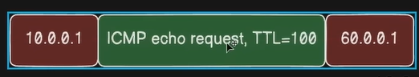
  - The request travels from the source device towards the destination.
  - If the destination receives the request, it creates an ICMP Echo Reply and sends it back to the source. The source and destination IP addresses are swapped in the reply.
  
  - The time taken to send the Echo Request and receive the Echo Reply is called Round Trip Time (RTT).

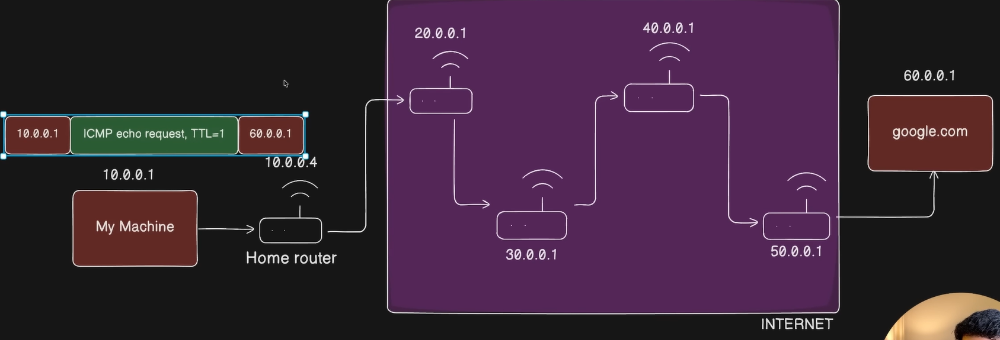

### If the destination is unreachable:
  - ping uses ICMP to detect whether destination is reachable or not.
  - A router may discover that the destination cannot be reached. In such a case, the router can send an ICMP error message, such as Destination Unreachable, back to the source. The router's IP address becomes the source IP of this error message, and the original source's IP becomes the destination IP.
  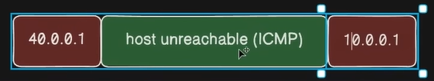

### TTL (Time To Live)
  - TTL is a value in the IP packet that prevents a packet from travelling around the network forever.
  - Every time the packet passes through a router, its TTL is decreased by 1. 
  - If TTL becomes 0, the router drops the packet. The router then sends an ICMP Time Exceeded message back to the source by adding source & dest IP. The source can use these TTL-expired messages to determine which router/hop caused the expiration.
    
  - Tools like traceroute / tracert use this behaviour to discover the routers (hops) between the source and destination. `tracert google.com` 


### How TraceRoute works
- It sends packets with different TTL values, starting from TTL = 1.
- The first router reduces TTL to 0, drops the packet, and sends back ICMP Time Exceeded → Hop 1. Futher traceroute will store IP of router which drops the packet.
- Then it sends another packet with TTL = 2 → reaches the second router → Hop 2.
- This continues until the packet reaches the destination.
- The time taken for each response is shown as the RTT.

<br>

## **UDP (User datagram Protocol)**
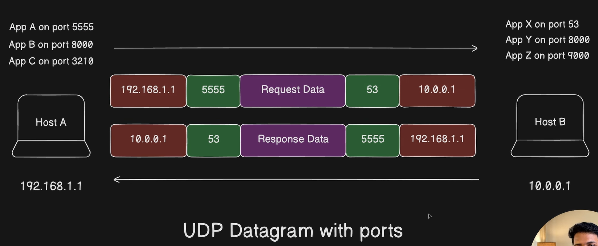
- Transport layer protocol.
- Data unit called as datagram(Encapsulated inside IP).
- Uses concept of ports to address processes in the host
- Does not require any connection unlike TCP which requires 3-way handshake.
- Stateless does keep track of datagram, does do re-transmission.
- Simple protocol for communication.
- Fast
- Unreliable(does not re-transmit a datagram once it get's lost)
- Header size of UDP datagram is 8 bytes.

### Usecases
- Used where we are okay with packet lost.
- WebRTC (Web real-time communication)
- Video streaming
- Game-play
- DNS - As UDP is not-reliable DNS itself check for the packet lost. `nslookup github.com dnssever_ip`
- QUIC - Transpost layer protocol(UDP + TCP)

### Anatomy of UDP datagram
- `src` & `dest` port occupies 2-bytes each.
- `Length` & `checksum` also occupies 2-bytes each.
- Length(total size of the datagram) = Total size of header + Total size of data(payload) it carries.
- `Checksum` hashes datagram on src device & validates it on the dest device.(like password hashing). If datagram gets corrupted it will be dropped.
- UDP header is formed by combining src port. dest post, length & checksum.
- Data(payload) represents actual application data carried inside a datagram. Such as dns query(`nslookup github.com dnssever_ip`) & query response(`Address:  20.207.73.82`)
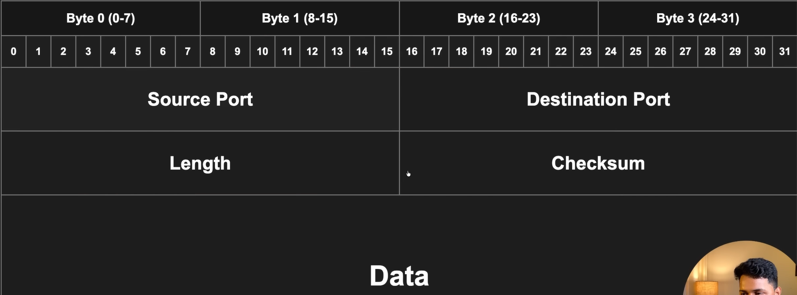

 
### Wireshark
- Network analyzing & capturing tool. It allows you to look inside network communication and understand what is happening.
- It lets you see the packets that are travelling through your network.
- For example, when you open google.com, many packets are exchanged. Wireshark can show you those packets and their details.
- What can you see?
  - For each packet, you can inspect things like:
    - Source IP → Where the packet came from
    - Destination IP → Where it is going
    - Protocol → TCP, UDP, HTTP, DNS, ICMP, etc.
    - Source/Destination Port
    - Packet size
    - TCP/UDP headers
    - Payload (when available)

<br>

## **TCP(Transmission control protocol)**
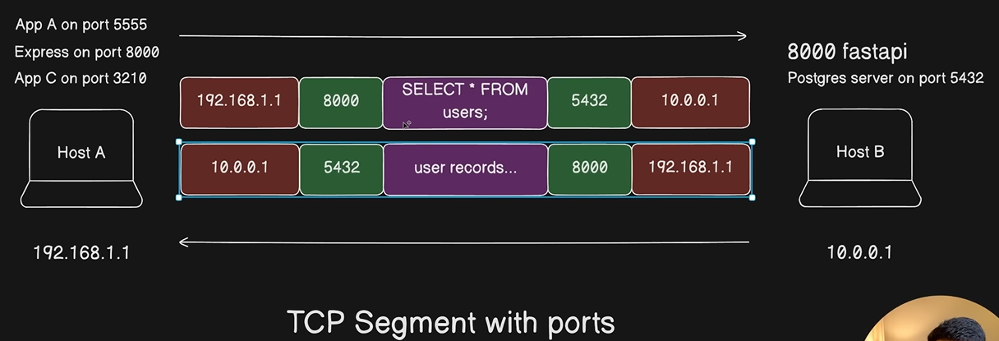
- Transport layer protocol
- Controls the transmission of data between two devices.
- Uses port numbers to identify applications on the host machine.
- Data unit called as segment(Encapsulated inside IP) in the form of 0 & 1.
- First it makes a connection. for that it uses 3-way handshaking
- Uses 4-ways termination to close the connection.
- Statefull
- Reliable (resends a segments until it reaches destination)
- Guarentee segments will be reached to destination in the same order it gets sended. 
- Slow as it makes connection which takes time.
 

### Usecases
- Database connections
- HTTP(s)/REST APIs 
- File transfer protocol(FTP) 
- Email (SMTP, IMAP, POP3) 
- SSH (Secure shell)


### 3-Way HandShake of TCP connection establishment
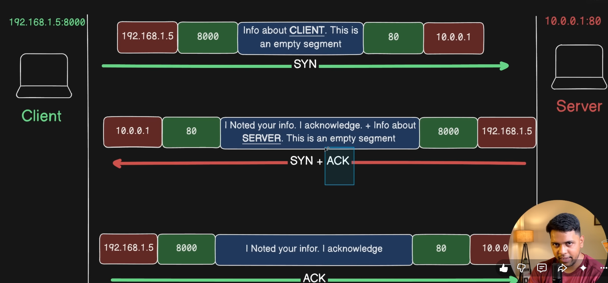
- **Why do we need a connection?** - TCP is a stateful protocol, so both devices must establish and synchronize connection state before exchanging data reliably. This is a fundamental requirement for reliable communication
- **Steps of handshake** 
  - Client sends a `syn` segment to the server.
  - Server notes  the client information & send a `ack` + `information about itself` back to client.
  - Further client will send a `ack` back to server. 
- Now client & server can send application data(payload). 

### 4-Way termination of TCP connection
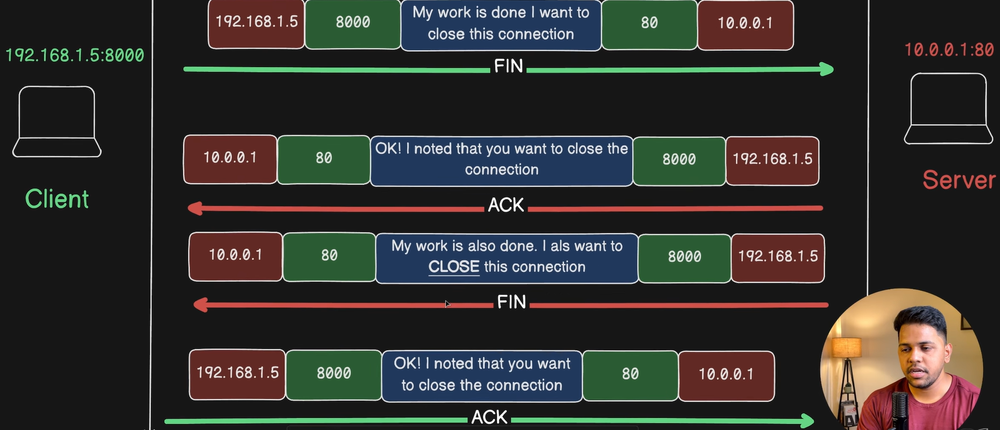
- Client  sends a `fin` request to server.
- Server `ack` the request.
- Server sends a `fin` request to client.
- Client `ack` the request.

### Segment Sequence Number 
- Every byte sent over a TCP connection is numbered 
- The Sequence Number field contains the position of first byte of segment in the original byte string.  
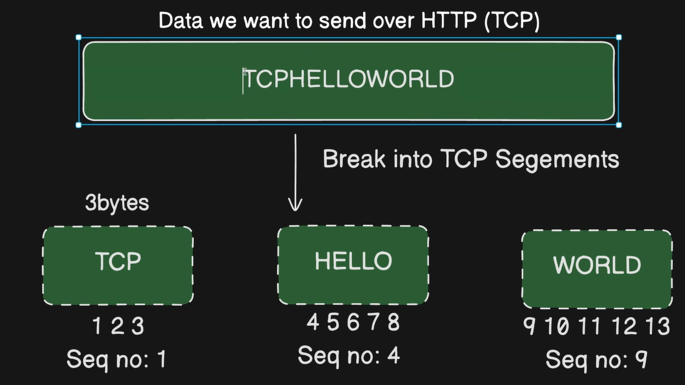
- All segments travels over the network independentely. So sequence number helps the receiver to reassemble data in the correct order. 
- Enables retransmission of lost segments 
- Prevents duplicate data from being accepted multiple times 
- Initial sequence number of a segment is shared by the client to server during the TCP 3-way handshake. 

 
### TCP Acknowledgment Number (ACK) 
- ACK is used to confirm successful receipt of a segment. 
- The ACK number contains the next sequence number receiver expecting to receive. 
  ```
    Receiver received bytes 1000–1499
    ACK = 1500
  ```
- Helps the sender know what data has arrived and what may need retransmission.

<br>

## **Anatomy of Segment(Headers + payload)**
- TCP sends data in the form of segments. Each segment having two part (header,payload).

### Headers
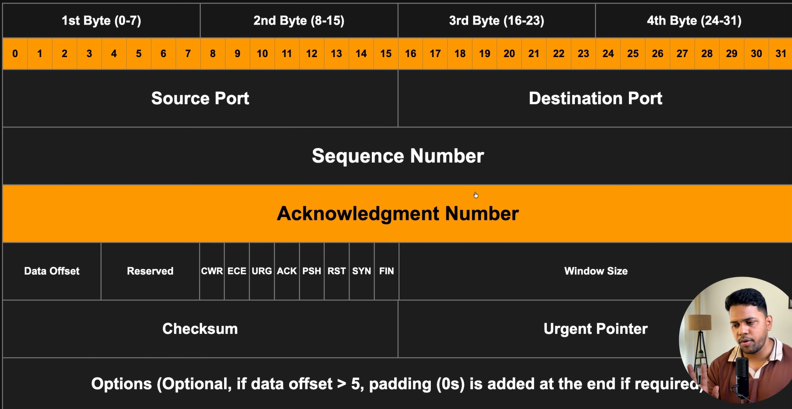
- contains control information needed to deliver data reliably.
- has a minimum size of 20 bytes and can be up to 60 bytes when options are present.
- `source port` tells the port number of the application that sent the data. size is 2-byte
- `destination port` tells the port number of the application that should receive the data. size is 2-byte.
- `sequence number` is of 4-byte 
- `aknowledgement number` is of 4-byte 
- `Data offset` represent the starting point of payload. It tells the receiver the size of the TCP header. Because TCP header size is not always 20 bytes. It can become larger when options are present. It can be `>=5`. `1 dataOffset = 4bytes`
- `Reserved` is a `3-bit` space reserved for future use.
- `TCP flags`:- 1 bit each. Can be either 0(not set) or 1(set).
    - `CWR — Congestion Window Reduced` used by sender to tell reciever that i'm reducing the sending rate/window because of network congestion.
    - `ECE — ECN Echo` used by reciever to tell the sender to reduce the sending the rate.
    - `URG — Urgent` It tells TCP that some data should be treated as urgent.
    - `ACK — Acknowledgment` Used by reciever to acknowledge received data.
    - `PSH — Push` Tells TCP to push the received data to the application without unnecessarily waiting for more data.
    - `RST — Reset` Used to immediately terminate/reset a TCP connection.
    - `SYN — Synchronize` Used to start a TCP connection.
    - `FIN — Finish` Helps perform a graceful TCP connection termination.
- `Window size` represents the capacity of data reciever can handle. Used for flow control. size is 2-byte
- `Checksum` Used to detect whether the TCP segment was corrupted during transmission. Sender calculates the checksum and puts it in the header. Receiver calculates it again and compares. If the values don't match: Data was probably corrupted.

- `options`  size can be upto 40bytes. Used for adding Optional information for TCP. Possible Header Options are, MSS (Maximum Segment Size), Timestamp, Window Scale, Selective Ack.

### Payload
- The payload is the actual data being carried by a TCP segment.


<br>

## **Maximum Transmission Unit(MTU)**
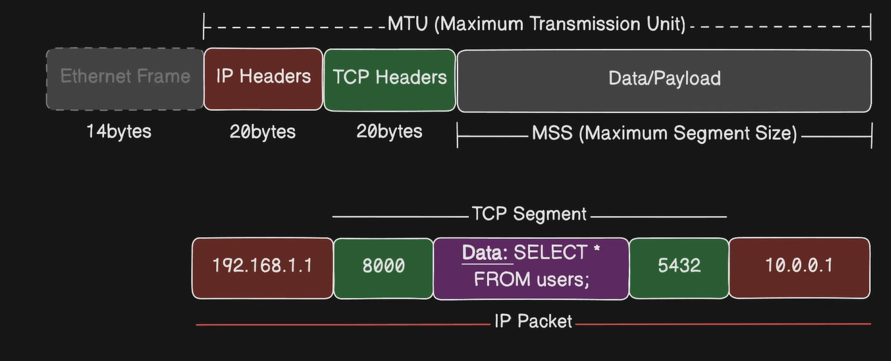
- Represents maximum size of an IP packet a link can carry without fragmentation(dividing IP packets). 
  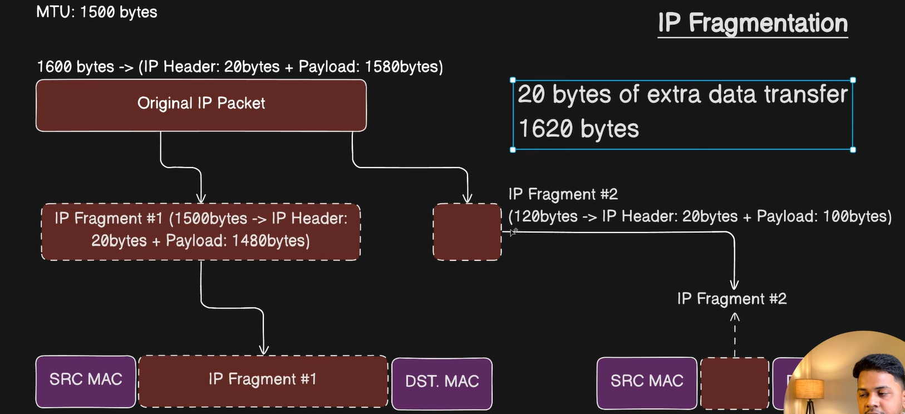
    - Here the mtu=1500 bytes. But the packet size is 1600 so the packet will be divided into two pacets(1500 + 120). After that both packets will be converted into frames.
- MTU includes IP header + TCP/UDP header + payload 
- Ethernet header is not part of MTU (IMPORTANT) 
- Wifi MTU is typically 1500 bytes 
- Different links can have different MTUs 
- Exceeding MTU can cause fragmentation or packet drops

<br>

## **MSS (Maximum Segment Size)**
- TCP-only concept.
- Sends in header's options during 3-way handshake.
- Maximum TCP payload in a single segment (Except TCP Headers)
- `MSS = MTU - IP Header - TCP Header `
- Standard Ethernet MSS = 1460 bytes 
- Advertised during TCP three-way handshake 
- MSS helps avoid fragmentation. Partition of data will be done by the TCP. 
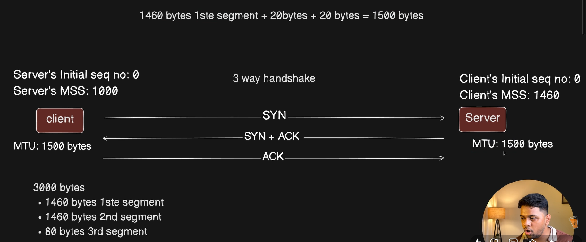

<br>
 
## **PMTUD (Path MTU Discovery)**
- Whenever data travels over the network it goes through many routers & every router have a MTU & in some cases it's less than the sender's MTU which can cause fragmentation. So prevent from this first we find the `PMTU`(smallest MTU along the path). 
- PMTUD is used to detect minimum MTU among all the devices from sender to reciever which helps in preventing IP packets form fragmentation.
- How PMTUD works:-
  - Sender starts with larger IP packets by setting DF(don't fragment) flag present inside IP packet headers. 
  - Routers drop if `packet size > router MTU` & sends ICMP "Fragmentation Needed". 
  - Sender reduces packet size.
  - Continues until packets pass successfully

<br>

## **Stop & Wait in TCP**
- In this client wait for sending a segment until it recieves a acknowledgement for the previous segment from the server.
- Good if the size of data is small. 
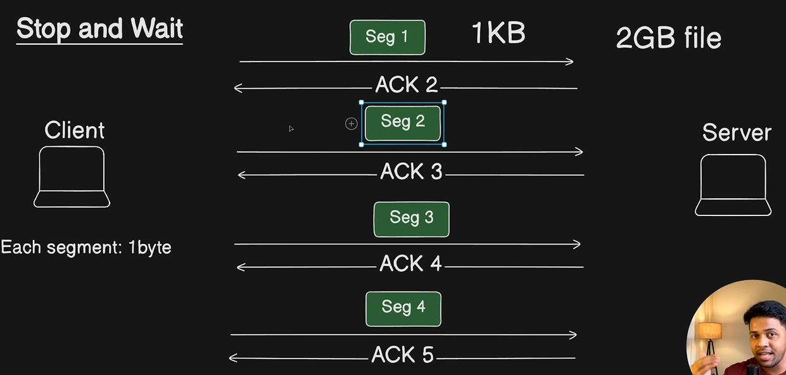
- Cummulative acks is the process of sending a single ack back to sender for multiple segments. To decide the number of segments it uses flow contol.
  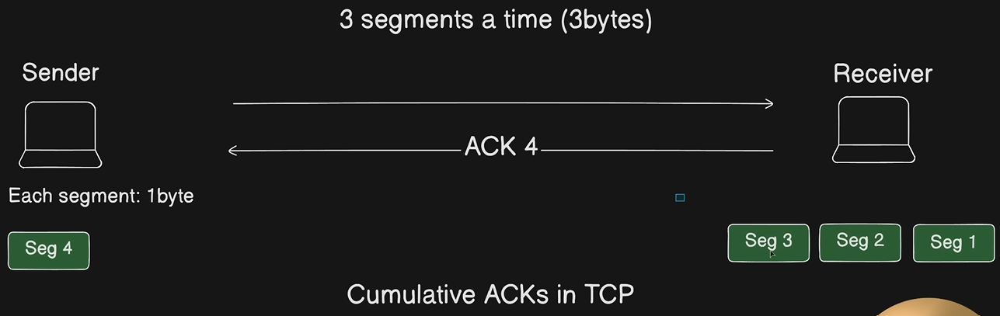


<br>

## **Flow-control in tcp**
- Flow control is a mechanism used by TCP to control the amount of data sent by the sender.
- Its main purpose is to prevent a fast sender from overwhelming a slow receiver.
- TCP uses the Receive Window (rwnd) for flow control.

### Receive Window (rwnd) (Known through 3-way handshake)
- The receiver has a buffer(in bytes) where incoming TCP data is temporarily stored.
- The receiver tells the sender how much free buffer space it currently has.
- This value is called the Receive Window (rwnd).
- It is advertised in the Window Size field of the TCP header.
- As size of window is `2-bytes` so the maximum amount of data which can be received by reciever will be `65kb` at a time which is not great as it will take a lot of time. To solve this we use `window scaling.`

### How TCP Flow Control Works?  

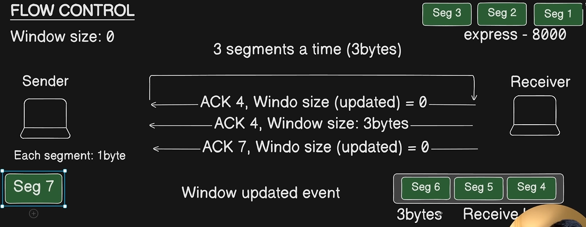
- The receiver tells the sender it's window size.
- The sender can send data up to the allowed window.
- After recieving reciever sends ack(ackNumber + currentWindowSize) back to sender.
- If the `currentWindowSize=0` sender will wait for the another ack back from the reciver.

## Window Scaling Factor
- Solves the 65 KB TCP window limitation.
- Value ranges from 0 to 14 
- Sends during TCP three-way handshake in the options field of tcp headers.
- Used to get Actual/Effective window size
  ```
   Actual Window size = Window Size * 2 ^ (Window scaling factor)
  ```

<br>

## **Congestion control in tcp**
- Congestion Control is a mechanism that prevents the network (routers and links) from becoming overloaded  
- The receiver's window size (`rwnd`) may be larger than what the network can currently handle. If the sender sends data according to `rwnd` alone, the network may become congested, which can cause packet loss.
- To prevent this, TCP limits the amount of unacknowledged data using both the receiver's capacity and the network's capacity.
- Therefore, the effective sending window is: `min(rwnd, cwnd)`
  - `rwnd` → Receive Window; represents how much data the receiver can currently accept.
  - `cwnd` → Congestion Window; represents how much data TCP currently allows to be in transit based on network congestion.

<br>

## **Algorithms used by tcp to find cwnd**

### TCP Slow Start & Congestion Avoidance : 
- Starts slow and gradually increases the CWND size (approx. doubles every RTT)

  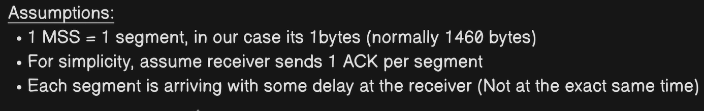
  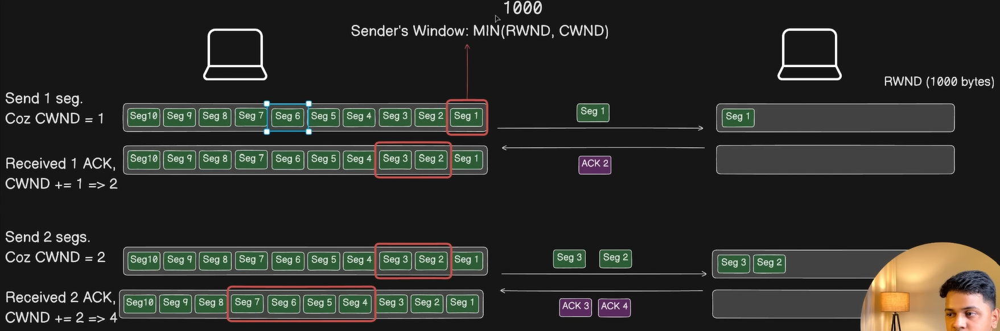

  ```
  CWND = CWND + 1 (after each ACK)
  ```

- Every sender have a value called slow start threshold(ssthresh) in bytes. Whenever `cwnd == ssthresh`. TCP switches the algorithm from slow start to congestion avoidance.
  ```
  CWND = CWND + 1/CWND (after each ACK)
  ```
  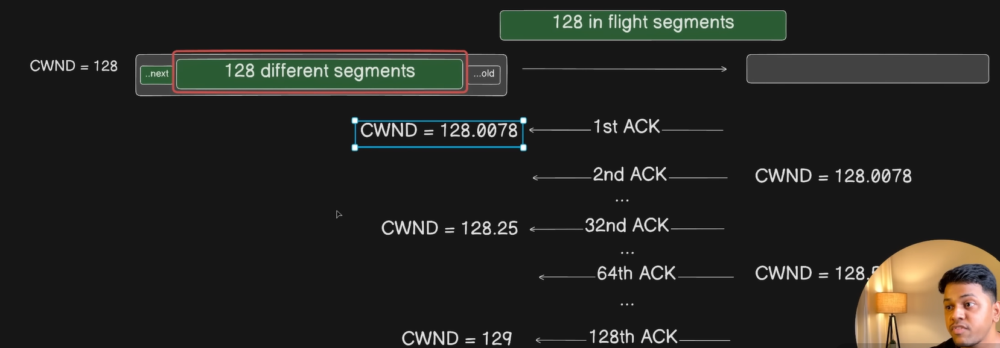

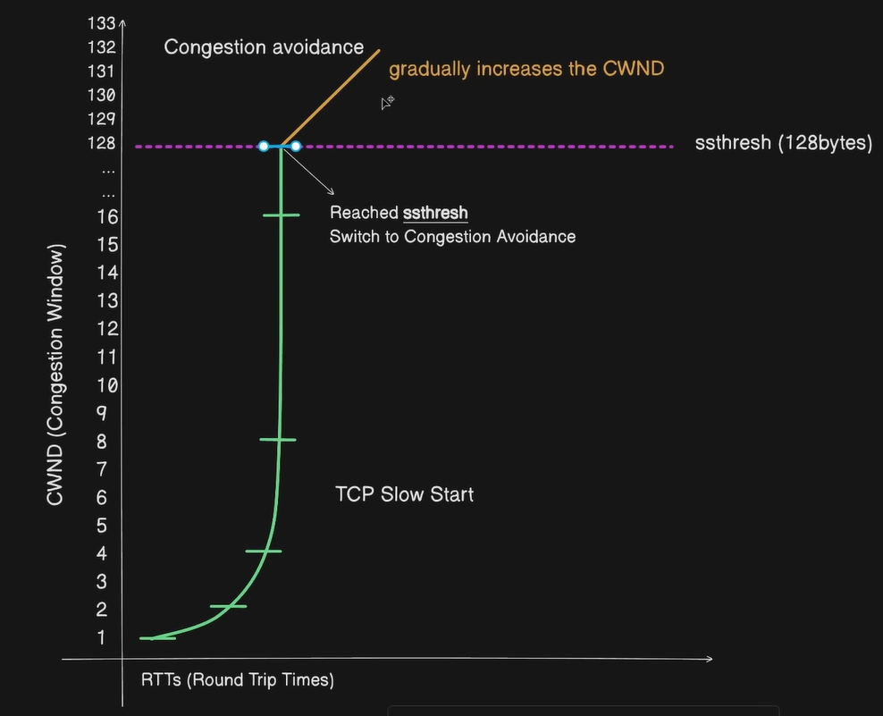


 
<br>

## **How TCP Detects Congestion(packet lost)?**
### Retransmission Timeout (RTO)  
- Sender transmits a segment 
- Expected ACK does not arrive before the timeout expires 
- TCP assumes severe congestion or packet loss 
- Considered a strong indication of congestion 

### Triple Duplicate ACKs 
- Receiver repeatedly acknowledges the same missing packet  
- Sender receives 3 duplicate ACKs for the same sequence number 
- TCP assumes a packet was lost due to congestion


<br>

## **How congestion window behaves after detecing congestion?**
- For both RTO & triple duplicates acks congestion window behaves differently.
- For triple duplicates acks conjestion tcp sets `ssthresh = cwnd / 2` & `cwnd = cwnd/2` & tcp shifts  to  congestion avoidance.
- In case of RTO, tcp sets `ssthresh = cwnd / 2` & `cwnd = 1` & tcp shifts to slow start.

<br>

## **How TCP can detect Congestion before it happens?**  
### ECN (Explicit Congestion Notification) 
- Traditional TCP detects congestion after packet loss occurs
- ECN allows routers to indicate congestion before dropping packets 
- Helps reduce unnecessary packet loss and retransmissions.
- Whenever any intermediate device detects congestion can happens it first sets the `ECN` flag(present in IP header) & then send it to reciever.
- After that reciever inform about this conjestion to sender by using `ECE` flag (present in segment header) during 'ack'.
- Then sender reduces `cwnd` & sets `cwr` flag(present in segment header). 
- During 3-ways handshake both `ece` & `cwr` sets by-default which represent device supports `ECN`.

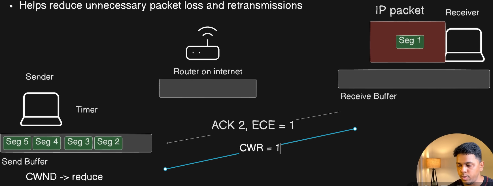

<br>

## **What is DNS (Domain Name System) and Why Do We Need It?** 
`nslookup github.com`  
- Humans cannot remember IP addresses but they can remember domain names 
- Computers communicate using IP addresses, not domain names - DNS provides a name - IP address mapping mechanism 
- IP can change while domain remains the same 
- Allows directing users to the nearest server/CDN 
- Can be used for load balancing (not fine grained one)
- Built on top of UDP, runs on port 53
- Domain internal structure.
  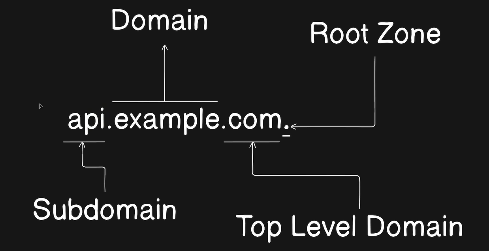
  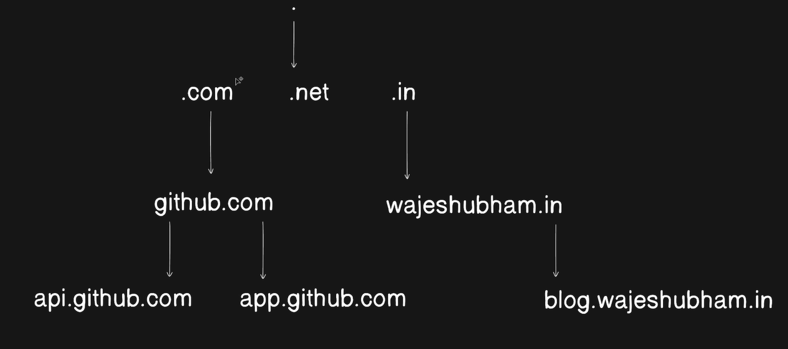

<br>

## **How dns works?**
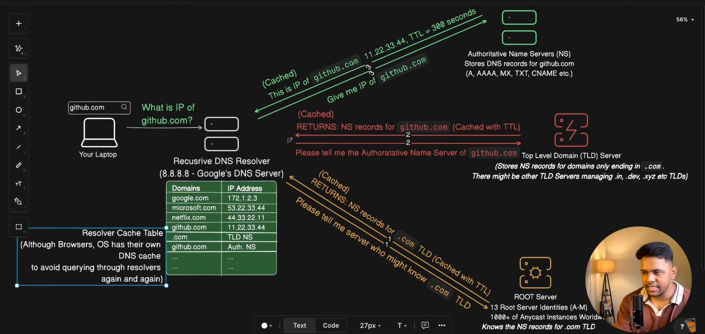
- User enters or searches for a website in the browser. The browser needs the **IP address** of the server hosting that website.
- The browser first checks its **DNS cache**.
  - If the IP address is found → use it.
  - Otherwise → check the **OS DNS cache**.
  - If found → use the IP address.
  - Otherwise → send a request to a **DNS resolver**.
- The request is sent to a **DNS Resolver**. It is usually provided by:
  - ISP
  - Router
  - Public DNS service
- The resolver first checks its **own cache**.
  - It may have cached information such as the IP address or DNS server information.
  - If the required answer is found → it returns the IP address.
  - If not → it performs a DNS lookup by contacting other DNS servers.
- First, the resolver contacts a **`Root DNS Server`** to find the appropriate **`TLD (Top-Level Domain) server`**, such as `.com`, `.in`, `.org`, etc.
- Then, the resolver contacts the **`TLD Server`** to find the **`Authoritative DNS Server`** responsible for the requested domain.

- Finally, the resolver contacts the **`Authoritative DNS Server`**, which contains the actual DNS records for the domain.
  - It returns the requested DNS record, such as the **IP address**, along with its **TTL (Time To Live)** in seconds. TTL tells the resolver how long the result can be cached. 

- The resolver sends the IP address back to the user's computer.
  - The result is usually cached for the specified TTL so that the same lookup does not need to be performed again immediately.

- Now the browser knows the **IP address** of the server.
  - It can establish a connection with the server and request the website.

<br>

## **DNS Caching**
- DNS results are cached at different places. Stores in key-value form.
```
Browser
   ↓
  OS
   ↓
DNS Resolver
```
- If the IP address is already cached, DNS doesn't need to perform the complete lookup again.
- This makes DNS faster and reduces unnecessary DNS traffic.


<br>

## **DNS record**
- DNS records are instructions stored on `authoritative servers` that tell the internet how to route traffic for a domain name.
- DNS records is like a contact list on your phone. They match human-friendly website names (like example.com) to the machine-friendly IP addresses and servers that run websites
- Below are some types of records:-


## **`A` record**
- A = Address
- Maps a domain name to an IPv4 address.
- What is IPv4 address of wajeshubham.in? DNS Replies: 3.111.187.148 (It may return one or more IPv4 addresses) 
- Multiple A records can exist for a single domain (for load balancing/failover/high availability)

## **`AAAA` record**
- Maps a domain name to an IPv6 address.
- What is the IPv6 address of wajeshubham.in? DNS Replies: 2606:4700:90d2:7cbc:c29e:8b4:5ff2:75c4 (It may return one or more IPv6 addresses)  
- Multiple AAAA records can exist (for load balancing/failover/high availability)

## **`MX(Mail Exchange)` Record**
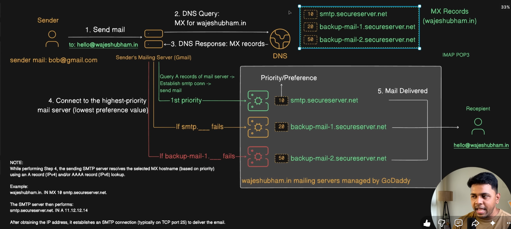
- Used by SMTP(simple mail transfer protocols) servers during email delivery. 
- Lower the priority value of a MX record higher the preference. 
- Multiple MX records can exist for redundancy and failover.
- MX records contain hostnames, not IP addresses.
- SMTP servers perform A or AAAA lookups on the MX hostname before connecting.
- If the highest-priority mail server is unavailable, the next MX record is tried 
- MX records do not store emails, they only show where emails should be delivered
- Multiple MX records with the same priority value can be used for load balancing


## **`CNAME` Record**  
- stands for Canonical Name Record 
- Maps one domain/subdomain to another domain name., not directly to an IP address 
- The target hostname/domain must eventually resolve to an A record or AAAA record
- Target domain must have a `A` or `AAAA` record. 

```
Example: www.example.com → example.com
```
- When a user requests: `www.example.com` browser will ask for 'A' record from DNS. Then DNS will tell i don't have but i have `cname` record.
- DNS follows the `CNAME` to: `example.com` and then looks for its IP address.


## **`NS(Name server)` Record**
- Specifies the authoritative DNS servers for a domain.
- These servers contain the DNS records for that domain.
- Without NS records, resolvers would never know where to find a domain's DNS records 
- A domain usually has multiple name servers for redundancy and high availability
```
Ex:- example.com → ns1.example-dns.com
    example.com → ns2.example-dns.com
```

### DNS Delegation
- DNS delegation means **giving responsibility for a domain/subdomain to another DNS server**.

### What happens when you search a website?
- Suppose you enter: `www.example.com`. The dns resolver doesn't know the IP.
- First, resolver asks from `root dns server`. Root says:
  - "I don't know `example.com`,
  - but `.com` is handled by this `TLD(Top-level domain) server`
- Again, resolver asks from `.com` TLD server. The TLD server says:
  - "I don't know the IP of `www.example.com`,
  - but `example.com` is managed by: these `Authoritative DNS Server` (`ns1.example.com`, `ns2.example.com`). 
  - THIS IS `DELEGATION`.
- Resolver again asks `Authoritative DNS Server`(ns1.example.com) to get the actual dns record.


## **`TXT(text)` Record** 
- Stores text information associated with a domain.
- Originally designed for human-readable notes
- Now, commonly used for Domain ownership verification,SPF email authentication
- A domain can have multiple TXT records 
- TXT records don't affect website routing.

### Text records used for spf(sender policy framework)
- SPF allows a domain owner to specify which mail servers/IP addresses are allowed to send emails on behalf of their domain. The receiving mail server checks the sender's IP against this SPF policy. 
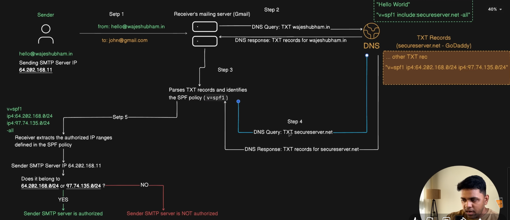

### Steps how it checks:-
- Step-1: Email is Sent
  - The sender sends an email from: `hello@wajeshubham.in`
  - The email is sent to: `john@gmail.com`
  - The receiving mail server (Gmail) receives the email.
- Step-2: Gmail Checks the SPF Record
  - Gmail finds the domain of the sender: `wajeshubham.in`
  - It asks DNS for the **TXT records** of this domain `DNS Query: TXT wajeshubham.in`
  - DNS returns the TXT records, including the SPF record:
    ```text
      v=spf1
      ip4:64.202.168.0/24
      ip4:97.74.135.0/24
      -all
    ```
- Step 3 — SPF Record is Identified
  - Gmail looks through the `TXT records` and identifies the SPF record.
  - The SPF record tells Gmail which IP addresses are allowed to send emails for `wajeshubham.in`.

- Step 4 — Check Included SPF Records
  - If the SPF record contains an `include`, Gmail also checks the SPF record of that domain `include:secureserver.net`
  - Gmail asks DNS for: `TXT secureserver.net`
  - DNS returns the SPF information of `secureserver.net`.

- Step 5 — Check Sender's IP
  - Gmail gets the IP address of the server that actually sent the email: `64.202.168.11`
  - It checks whether this IP belongs to any of the IP ranges allowed by the SPF policy.
  ```
    64.202.168.0/24
    97.74.135.0/24
  ```
- Step 6 — SPF Result
  - If the sender's IP belongs to an authorized IP range: `SPF → PASS` The sender's server is authorized to send email for the domain.
  - If the IP does not belong to any authorized range: `SPF → FAIL` The sender's server is not authorized to send email for the domain.

## **`PTR(Pointer record)` record**
- PTR records are used for reverse DNS lookups 
- PTR records map IP Address -> Hostname 
- Opposite of A and AAAA records 
- Usually configured by the IP address owner, not the domain owner (Cloud Providers/ISPs etc) 
- A missing PTR record does not stop a website from working, but it can negatively affect the reputation of a mail server sending emails into the spam.

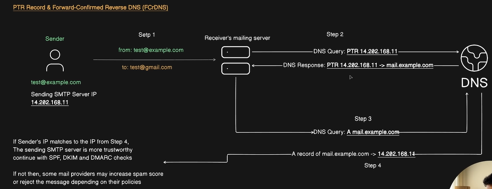