## Database
- Collection of related data.
- Divided into two types `structured(RDBMS)` & `unstructured(web-pages)`.

## DBMS
- Tool used to perform operations on the database.
- MySQL, PostgreSQL, Oracle, MongoDB.

<br>

## **File System vs DBMS**

| File System | DBMS |
|---|---|
| Stores data in files and folders. | Stores data in a structured database. |
| Data is usually managed by the operating system. | Data is managed by the DBMS. |
| Has more chances of duplicate data. | Helps reduce data duplication. |
| Searching data is slow. | Searching data is generally faster. |
| Need exact location of data which we want to search. | No need of location we just write queries. |
| Mutiple people cannot access at the time| Mutiple people can access at the time|
| Data consistency is difficult to maintain. | Provides better data consistency. |
| Provides limited security features. | Provides better security and access control. |
| Relationships between data are difficult to manage. | Can easily manage relationships using tables and keys. |
| No proper transaction management. | Supports transactions using ACID properties. |
| Example: `.txt`, `.csv`, `.json` files. | Example: MySQL, PostgreSQL, Oracle, MongoDB. |

<br>

## **2-Tier Architecture**
- In 2-tier architecture, the client directly communicates with the database server.
  ```
  Client
    ↓
  Database Server
  ```
- Easy to understand.
- Good for small applications.
- Difficult to maintain when many clients exist.
- Security can be weaker because clients directly access the database.

<br>

## **3-Tier Architecture**

- In 3-tier architecture, the client does not directly communicate with the database.
  ```
  Client
    ↓
  Server
    ↓
  Database
  ```
- Better security because the client does not directly access the database.
- Easy to scale.
- Suitable for large applications.

<br>
<br>

# **Schema**
- A schema is the structure/logical-representation of a database.
- It defines:
  - What tables exist.
  - What columns they contain.
  - What data type each field has.
  - What relationships exist between tables.
  - Rules such as primary key, foreign key, NOT NULL, etc.

## **3-Schema Architecture**
- describes a database using 3 different levels of abstraction.
- It separates what the user sees, how the whole database is organised, and how the data is physically stored.

```
        Users
          ↓
┌─────────────────────┐
│  External Schema    │  → What each user sees
└─────────────────────┘
          ↓
┌─────────────────────┐
│  Conceptual Schema  │  → Complete logical database
└─────────────────────┘
          ↓
┌─────────────────────┐
│  Internal Schema    │  → How data is physically stored
└─────────────────────┘
          ↓
     Storage/Disk
```

### **External Schema**
- Also called `View Level`.
- Defines what a user can see.
- Different users can have different views of the same database.
- Hides unnecessary data from the user.
- Example:

  For a college database:
    ```
    Student sees:
    Name, Roll No, Branch, Marks  
    ```
  But an accountant may see:
  ```
  Name, Roll No, Fees
  ```
### **Conceptual Schema**
- Also called Logical Level.
- Describes the complete logical structure of the database(DB designer).
- Defines: Tables, Columns, Relationships, Constraints, Keys

### **Internal Schema**
- Also called Physical Level.
- Describes how data is actually stored in the storage system(DB administrators).
- Deals with things like: Files, Blocks, Indexes, Storage locations, Data structures

<br>
<br>

# **Data Independence**

- Data Independence means we can change one level of the database without affecting the next higher level.

<br>

## **Logical Data Independence**
- It means changing the logical/conceptual schema without changing the external views used by users.
- Examples of changes
  - Changing file organisation
  - Adding/removing indexes
  - Changing storage structure
  - Changing data storage location

- Example

  Initially
  ```
  Student
  ----------------
  ID
  Name
  Branch
  ```
  Later, we add:
  ```
  Email
  Phone
  ```
  An existing user view that only shows:
  ```
  Name, Branch
  ```
  can continue working without needing to change.

<br>

## **Physical Data Independence**
- It means changing the physical/internal storage without changing the logical/conceptual schema.
- Example

  Initially:
  ```
  Student Table
     ↓
  Stored in normal data files
  ```
  Later, we add an index to make searching faster:
  ```
  Student Table
     ↓
  Index + data files
  ```
  The table structure remains the same.

<br>
<br>

# **Integrity Constraints Rules**
- Integrity constraints are rules defined in a database to maintain accuracy, consistency, and reliability. 

## **Types**

## **1. Domain Constraint**
- Defines what type of value can be stored in a column.
  ```
  Age → INTEGER
  Name → VARCHAR
  Marks → 0 to 100
  ```
  So
  ```
  Age = "Hello" ❌
  Age = 20     ✅
  ```

<br>

## **2.  NOT NULL Constraint**
- A column cannot contain NULL values.
`name VARCHAR(50) NOT NULL`

<br>

## **3. Candidate Key Constraint**
- A candidate key is a minimal set of attributes (columns) that can uniquely identify each row (tuple) in a table.
- A candidate key can be a single attribute or a combination of multiple attributes (composite candidate key).
- A candidate key cannot contain NULL because it must uniquely identify every row.
- A table can have multiple candidate keys.
- One candidate key is selected as the `Primary Key`.
- The remaining candidate keys are called `Alternate Keys`.
- Examples are `email`, `rollno`, `aadharno`.

<br>

## **4. Entity Integrity / Primary Key Constraint**
- A primary key is the candidate key selected to uniquely identify each row.
- It must be unique.
- It cannot be NULL.
- A table can have only one primary key constraint, but that primary key can contain multiple columns (`composite primary key`).

<br>

## **5. Foreign Key Constraint**
- creates a relationship between two tables.
- Attribute or set of attributes that references to the primary key of same or different table.
- Example:

  Refrenced table

  ```
  Course
  ----------------
  Course_ID  → Primary Key
  Course_Name
  ```

  Refrencing table

  ```
  Student
  ----------------
  Student_ID
  Name
  Course_ID  → Foreign Key
  ```
  If Course_ID = 10 does not exist in the Course table, a student cannot normally reference it.

## **Referential Integrity**
- ensures that a Foreign Key always refers to a valid row in another table.

### Operations on Referenced Table
- `INSERT`: Usually, no referential integrity violation. Adding a new value to the Primary Key does not affect existing Foreign Keys.

- `DELETE` :  May cause a violation if the row is being used by the referencing table.
  - `ON DELETE CASCADE`: Delete the parent row and automatically delete the related child rows.
  - `ON DELETE SET NULL`: Delete the parent row and set the related Foreign Key values to NULL.
  - `ON DELETE NO ACTION`: Do not allow the parent row to be deleted if child rows are using it.


- `UPDATE`: Updating the Primary Key of the referenced table may cause a violation if that value is being used by a Foreign Key.


### Operations on Referencing Table
- `INSERT`: May cause a violation.

- `DELETE` :  Usually, no referential integrity violation.

- `UPDATE`: May cause a violation if we update the Foreign Key to a value that does not exist in the referenced table.

<br>

## **6. Super-key**
- A super key can be formed by taking one candidate key and adding zero or more other attributes.
- Example 
    | RollNo | Email              | Name | Age |
    |--------|--------------------|------|-----|
    | 1      | a@mail.com         | A    | 16  |
    | 2      | b@mail.com         | B    | 17  |
    | 3      | c@mail.com         | C    | 16  |
    | 4      | d@mail.com         | D    | 17  |
- ### Which Combinations Are Super Keys?
  **Single columns:**
  ```
  RollNo  → unique on its own      ✅ Super Key
  Email   → unique on its own      ✅ Super Key
  Name    → NOT unique (A/A repeat possible) ❌
  Age     → NOT unique (16/16 repeats)       ❌
  ```
  **Combinations (adding more columns never breaks uniqueness, only adds redundancy):**
  ```
  (RollNo, Name)         → still unique  ✅ Super Key
  (RollNo, Age)          → still unique  ✅ Super Key
  (RollNo, Name, Age)    → still unique  ✅ Super Key
  (Email, Name)          → still unique  ✅ Super Key
  (RollNo, Email, Name, Age) → still unique ✅ Super Key
  ```
  So this table actually has **many** valid super keys — any combination that includes `RollNo` or `Email` automatically stays unique, no matter what else is added.
 

<br>
<br>

# **ER-Model** 
- ER Model is used to design a database before creating the actual tables.
- It shows:
  - Entities → What objects/data we store
  - Attributes → Properties of those objects
  - Relationships → How entities are connected


## **1. Entity**
- An entity is a real-world object about which we want to store information.
- Examples: Student, Teacher, Course, Employee, Customer
- In an ER diagram, an entity is represented by a rectangle.
  ```
  ┌─────────────┐
  │   Student   │
  └─────────────┘
  ````

## **2. Attribute**
- An attribute describes the properties of an entity.
- For Student:
  ```
  Student
    ↓
  RollNo
  Name
  Email
  Branch
  ```
- In an ER diagram, an attribute is represented by an oval.
  ```
            (Name)
              |
  (RollNo) — Student — (Email)
              |
            (Branch)
  ```


## **3. Relationship**
- A relationship shows how two or more entities are connected.
- Example
  ```
  Student ───── Enrolls ───── Course
  ```
  Here:
  - Student → Entity
  - Course → Entity
  - Enrolls → Relationship

- In an ER diagram, a relationship is represented by a diamond.
  ```
  ┌─────────┐       ◇─────────◇       ┌─────────┐
  │ Student │───────│ Enrolls │───────│ Course  │
  └─────────┘       ◇─────────◇       └─────────┘
  ```

<br>
<br>

# **Types of attributes**
## KeyAttribute
- It uniquely identifies each & every row(Primary key).
- represented by an oval with the attribute name underlined.

## Simple Attribute 
  - Cannot be divided further. 
  - <b> Example: Age </b>

## Composite Attribute 
- can be divided into smaller attributes. 
- **Example: Name → FirstName + LastName**

## Single-valued Attribute 
- Has one value for an entity. 
- **Example: RollNo**

## Multi-valued Attribute 
- Can have multiple values
- Represented by a double oval. 
- **Example: PhoneNo**

## Derived Attribute 
- Value can be calculated from another attribute.
- Represented by a dashed oval. 
- **Example: Age can be derived from DateOfBirth.**

<br>
<br>

# **Cardinality**
- tells us how many instances of one entity can be associated with instances of another entity.

## **One-to-One(1:1)**
- one instance of Entity A can be related to only one instance of Entity B, and vice versa.
- Example: **`Employee Works in Department`**

  - ### ER Diagram

      ```
      ┌──────────┐        ◇────────┐        ┌────────────┐
      │ Employee │─── 1 ─◇  Works  ◇─ 1 ───│ Department │
      └──────────┘        ◇────────┘        └────────────┘
      ```


  - ### Base Tables

      **Employee**

      | EID | Ename | Age |
      |-----|-------|-----|
      | E1  | A     | 20  |
      | E2  | B     | 25  |
      | E3  | C     | 28  |
      | E4  | A     | 24  |
      | E5  | B     | 25  |

      **Department**

      | DID | Dname | Loc    |
      |-----|-------|--------|
      | D1  | IT    | Bang.  |
      | D2  | Prod. | Delhi  |
      | D3  | HR    | Delhi  |

  - ### Creating a Separate Relationship Table

      **Works**

      | EID | DID |
      |-----|-----|
      | E1  | D1  |
      | E3  | D2  |
      | E5  | D3  |

      Here:
      - `EID` → Foreign Key → `Employee(EID)`
      - `DID` → Foreign Key → `Department(DID)`
      - Primary Key of Works → `(EID, DID)`

      Since it's a **1:1** relationship, one employee has only one department and one department has only one employee. So in the Works table:
      - `EID` alone uniquely identifies a row
      - `DID` alone uniquely identifies a row

      That means **both** EID and DID can individually act as candidate keys in Works.


- ### Can We Remove the Works Table?

  **Yes** — because Works has no attributes of its own.

  For a 1:1 relationship, we can usually avoid a separate relationship table by putting a Foreign Key in one of the entity tables instead.

  - **Option A: Put DID inside Employee**

      | EID | Ename | Age | DID  |
      |-----|-------|-----|------|
      | E1  | A     | 20  | D1   |
      | E2  | B     | 25  | NULL |
      | E3  | C     | 28  | D2   |
      | E4  | A     | 24  | NULL |
      | E5  | B     | 25  | D3   |

    Here:
    - `EID` → Primary Key
    - `DID` → Foreign Key → `Department(DID)`, and also **UNIQUE**


  - **Option B: Put EID inside Department**

      | DID | Dname | Loc   | EID |
      |-----|-------|-------|-----|
      | D1  | IT    | Bang. | E1  |
      | D2  | Prod. | Delhi | E3  |
      | D3  | HR    | Delhi | E5  |

      Here:
      - `DID` → Primary Key
      - `EID` → Foreign Key + **UNIQUE**

  Both options are valid ways to implement the same 1:1 relationship — choose whichever side makes more sense for your queries (e.g., pick the side that will less often have NULLs).

- ###  When Should You Keep the Relationship Table?

  Keep a separate Works table if the relationship itself carries data — i.e., it has its own attributes.

  **Example:**

  ```
  Employee ─── Works ─── Department

  Works:
  - JoiningDate
  - Salary
  - Shift

  These attributes are called Descriptive attribute
  ```

  **Works**

  | EID | DID | JoiningDate | Shift |
  |-----|-----|-------------|-------|

  In this case, the relationship holds meaningful information beyond just "who connects to whom," so a dedicated Works table makes sense — even though the underlying entity relationship is still 1:1.

<br>

## **One-to-Many (1:N)**
- one instance of Entity A can be related to many instances of Entity B. But each instance of B is related to one instance of A.
- Example : **`Customer gives Order`**
  - ### ER Diagram

      ```
      ┌──────────┐          ◇─────────◇          ┌─────────┐
      │ Customer │─── 1 ───◇   Gives  ◇─── M ───│  Order  │
      └──────────┘          ◇─────────◇          └─────────┘
                                |
                              Date
      ```

      **Meaning:**
      - One Customer can give many Orders.
      - Each Order belongs to one Customer.

  - ### Base Tables 

    **Customer**

      | ID | Name | City   |
      |----|------|--------|
      | C1 | A    | Jaipur |
      | C2 | B    | Delhi  |
      | C3 | C    | Mumbai |
      | C4 | A    | Mumbai |

      `ID` → Primary Key


      **Order**

      | O_no | Item_name | Cost |
      |------|-----------|------|
      | O1   | Bucket    | 1000 |
      | O2   | Shoes     | 2000 |
      | O3   | Shirt     | 1500 |
      | O4   | Jeans     | 2000 |

      `O_no` → Primary Key

  

  - ###  Creating a Separate Relationship Table

      - The **Gives** relationship can be converted into:


        | ID | O_no | Date |
        |----|------|------|
        | C1 | O1   | ...  |
        | C1 | O2   | ...  |
        | C2 | O3   | ...  |
        | C2 | O4   | ...  |

        Here:
        - `ID` → Foreign Key → `Customer(ID)`
        - `O_no` → Foreign Key → `Order(O_no)`
        - `Date` is an attribute of the relationship itself

        **Primary Key:** Because an order belongs to only one customer, and `O_no` is already unique on its own:

        ```
        O_no → Primary Key of Gives
        ```


  - ### Can We Reduce the Number of Tables?

    - **Yes.** Because this is a **1:M** relationship, we can remove the separate Gives table by putting the Foreign Key on the **Many** side.

      ```
      Customer 1 ───── M Order
                          ↑
                        FK
      ```

      So we add `CustomerID` (and `Date`) directly into the Order table.

      **New Order Table**

      | O_no | Item_name | Cost | CustomerID | Date |
      |------|-----------|------|------------|------|
      | O1   | Bucket    | 1000 | C1         | ...  |
      | O2   | Shoes     | 2000 | C1         | ...  |
      | O3   | Shirt     | 1500 | C2         | ...  |
      | O4   | Jeans     | 2000 | C2         | ...  |

      Now:
      - `O_no` → Primary Key
      - `CustomerID` → Foreign Key
      - `Date` → description Attribute

<br>

## **Many-to-One (N:1)**
-  reverse view of 1:N.

<br>

## **Many-to-Many (M:N)**
-  many instances of Entity A can be related to many instances of Entity B.
- Example: **`Student–study-course`**

  - ### ER Diagram

    ```
    ┌─────────┐       M      ◇───────◇      N       ┌────────┐
    │ Student │──────────────◇  Study ◇──────────────│ Course │
    └─────────┘              ◇───────◇               └────────┘
    ```

      **Meaning:**
      - One Student can study many Courses.
      - One Course can be studied by many Students.


  - ### Base Tables

      **Student**

      | RollNo | Name | Age |
      |--------|------|-----|
      | 1      | A    | 16  |
      | 2      | B    | 17  |
      | 3      | A    | 16  |
      | 4      | C    | 17  |
      | 5      | D    | 15  |

      `RollNo` → Primary Key

      **Course**

      | C_id | Name  | Credit |
      |------|-------|--------|
      | C1   | Maths | 4      |
      | C2   | Phy.  | 4      |
      | C3   | Chem. | 4      |
      | C4   | Hindi | 4      |

      `C_id` → Primary Key


  - ### The Study (Relationship) Table

    - Because this is an **M:N** relationship, we need a separate relationship table — this is not optional here.

      **Study**

      | RollNo | C_id |
      |--------|------|
      | 1      | C1   |
      | 2      | C2   |
      | 1      | C2   |
      | 2      | C1   |
      | 3      | C3   |

      Here:
      - `RollNo` → Foreign Key → `Student(RollNo)`
      - `C_id` → Foreign Key → `Course(C_id)`


  - ### Primary Key of Study

    - Notice that `RollNo` alone repeats:

      ```
      1 → C1
      1 → C2
      ```

      So `RollNo` alone **cannot** be the Primary Key.

    - Similarly, `C_id` alone repeats:

      ```
      C1 → Student 1
      C1 → Student 2
      ```

      So `C_id` alone **cannot** be the Primary Key either.

    - Therefore, we combine both:

      ```
      (RollNo, C_id) → Composite Primary Key
      ```


      This combination uniquely identifies each relationship. For example:

      ```
      (1, C1) → Student 1 studies Course C1
      (1, C2) → Student 1 studies Course C2
      ```


  - ### Why Can't We Remove the Study Table?

    - The relationship is:

      ```
      Student M ───── N Course
      ```

      A student can take multiple courses, and a course can have multiple students — so a single Foreign Key column can't capture this.

    - We **cannot** do this in Student:

      ```
      Student
      ----------------
      RollNo
      Name
      C_id        ❌
      ```

      ...because Student 1 might study C1, C2, and C3 — that would need multiple values crammed into one `C_id` column, which breaks basic relational table design (no repeating groups in a single cell).

      The same problem happens in reverse if we try putting `RollNo` inside Course.

<br>
<br>

# **Weak-Entity Set**
- Weak entity does not have any primary key.
- They cannot be uniquely identified by its own attributes, so they depend on some other strong entity(owner entity).
- Weak entity have partial keys which is represented with  `dotted underline`.
- Weak entity is represented with `double rectangle box`.
- The relationship between the strong entity and weak entity is represented by a  `double diamond`.
- Example: `Employee–has-Dependent`

  - ### ER Diagram

    ```
    ┌──────────┐             ◈════════◇             ╔═══════════╗
    │ Employee │════════════◈   Has    ◈════════════║ Dependent ║
    └──────────┘             ◈════════◇             ╚═══════════╝
    ```

    Here:
    - **Employee** → Strong Entity
    - **Dependent** → Weak Entity
    - **Has** → Identifying Relationship
    - **Amount** → Attribute of the Has relationship

 

  - ### Employee Table

    | E_ID | Name  | Address |
    |------|-------|---------|
    | E1   | Varun | Delhi   |
    | E2   | Ravi  | Mumbai  |
    | E3   | Amit  | Pune    |

    `E_ID` → Primary Key
.


  - ### 2. Dependent Table

    | E_ID | Name | Age |
    |------|------|-----|
    | E1   | Ravi | 16  |
    | E1   | Aman | 17  |
    | E2   | Ravi | 18  |
    | E3   | Amit | 16  |

    Notice **Ravi** appears for both E1 and E2. So:

    ```
    Name alone → ❌ Cannot uniquely identify a Dependent
    ```

    But:

    ```
    E1 + Ravi → unique
    E1 + Aman → unique
    E2 + Ravi → unique
    ```

    So `Name` acts as a **Partial Key**, and:

    ```
    E_ID + Name
          ↓
    Primary Key of Dependent
    ```

    **Dependent Table**

      ```
      Dependent
      -------------------------
      E_ID   → Foreign Key
      Name   → Partial Key
      Age

      PK = (E_ID, Name)
      ```


  - ###  Identifying Relationship

    ```
    ┌──────────┐       ◈══════════◈       ╔═══════════╗
    │ Employee │══════◈    Has     ◈══════║ Dependent ║
    └──────────┘       ◈══════════◈       ╚═══════════╝
    ```

    The double diamond marks **Has** as an identifying relationship, and the double line on the Dependent side shows **total participation**:

    > Every dependent must be associated with an employee.


  - ### Relationship Attribute — Amount

    ```
                        (Amount)
                            |
                            |
    ┌──────────┐       ◈══════════◈       ╔═══════════╗
    │ Employee │══════◈    Has     ◈══════║ Dependent ║
    └──────────┘       ◈══════════◈       ╚═══════════╝
    ```

    `Amount` belongs to the **Has** relationship, not to either entity alone.

    | E_ID | Dependent Name | Amount |
    |------|-----------------|--------|
    | E1   | Ravi            | 5000   |
    | E1   | Aman            | 3000   |
    | E2   | Ravi            | 4000   |

    `Amount` records how much is associated with that specific employee–dependent pair.


  - ### Can We Reduce the Number of Tables?

    **Yes.** Since a dependent belongs to exactly one employee, we can fold the relationship's attribute (`Amount`) directly into the Dependent table — no separate Has table needed.


    ```
    Employee
    ---------------------
    E_ID → PK
    Name
    Address

    Dependent
    ---------------------
    E_ID    → FK
    Name    → Partial Key
    Age
    Amount

    PK = (E_ID, Name)
    ```

    So we don't need a separate Has table — its attribute simply moves into the weak entity's table alongside the partial key.

<br>
<br>

## Row-Level Duplicacy
- When an entire row is repeated in a table, it is called row-level duplicacy.
- `primary-key` solves this problem.


## Column-Level Duplicacy
- When the same information is unnecessarily stored in multiple columns, it is called column-level duplicacy.
- Example:

  | RollNo | StudentName | CourseID | CourseName | Teacher |
  |--------|-------------|----------|------------|---------|
  | 1      | A           | C1       | DBMS       | Ravi    |
  | 2      | B           | C1       | DBMS       | Ravi    |
  | 3      | C           | C2       | CN         | Amit    |
  | 4      | D           | C1       | DBMS       | Ravi    |

  `C1 → DBMS → Ravi` is stored multiple times.
- Solve using normalization

<br>
<br>

# **Normalization**
- Normalization is the process of organizing data into multiple tables to reduce data duplication and avoid data anomalies.
- Main Goals
  - Reduce data duplication
  - Avoid insertion anomaly
  - Avoid update anomaly
  - Avoid deletion anomaly
  - Improve data consistency
- Normalization is performed in stages called `Normal Forms`. Each normal form removes certain types of problems.
  ```
  1NF
  ↓
  2NF
  ↓
  3NF
  ↓
  BCNF
  ```

<br>

## **Problems Due to Duplication**

### Update Anomaly

- Suppose the teacher of C1 changes: `Ravi → Rahul`
 
  We need to update every row containing C1.

  If we forget one row:
  ```
  C1 → DBMS → Ravi
  C1 → DBMS → Rahul
  ```
  Now the database contains inconsistent data.

### Insertion Anomaly

- Suppose we want to add a new course: `C3 → OS → Amit`

  but no student has enrolled in it yet.

  In the above table, we may not be able to store the course information without having a RollNo.

  So, we have difficulty inserting course data independently.

### Deletion Anomaly
- Suppose student C is the only student enrolled in C2.

  If we delete student C:
  ```
  3 | C | C2 | CN | Amit
  ```
  we also lose information about:
  ```
  C2 → CN → Amit
  ```
  So, deleting one student's information also deletes course information.

<br>

## **Solution - Decompostion** 

- Process of breaking one big table **R** into smaller tables **R1, R2, ...**
- After breaking, we should be able to **join the tables back** to get the original table.


### Lossless Decomposition

- After joining the smaller tables, we get **exactly the original table**.
- No extra rows. No missing rows.
- This is the **good** decomposition.


### Lossy Decomposition

- After joining, we get **extra (wrong) rows** that were not in the original table.
- We cannot tell which rows are real, so information is lost.
- This is the **bad** decomposition.


### How to Check

Decomposing **R** into **R1** and **R2** is **lossless** if all three are true:

1. **R1 ∪ R2 = R** (no attribute is dropped).
2. **R1 ∩ R2 ≠ ∅** (they have a common attribute).
3. The **common attribute is a candidate or super-key** of R1 or R2 (`R1 ∩ R2 → R1` or `R1 ∩ R2 → R2`).

If the common attribute is not a candidate or super-key of either table, it is **lossy**.


## Example

**R(A, B, C)** with **FD: A → B**

| A | B | C |
|---|---|---|
| 1 | x | p |
| 2 | x | q |

**Lossless: R1(A, B) and R2(A, C)**

- Common = `A`. Since `A → B`, A is a key of R1 ✔
- Join on A gives back (1, x, p) and (2, x, q). Same as original.

**Lossy: R1(A, B) and R2(B, C)**

- Common = `B`. B is not a key of R1 or R2 ✘
- R1 = (1, x), (2, x) and R2 = (x, p), (x, q)
- Join on B gives **4 rows**: (1,x,p), (1,x,q), (2,x,p), (2,x,q)
- Two rows are fake. We lost the information of which A goes with which C.


<br>
<br>

# **1NF — First Normal Form**
- Table  will be 1NF if does not  contain any muti-valued attribute.

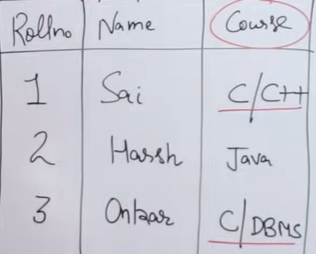

It's not in 1NF

## Ways to convert table into 1NF
- Through adding extra rows

  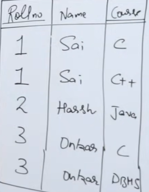

  Here primary key will be combination of `rollno+course`

- Through adding extra cols

  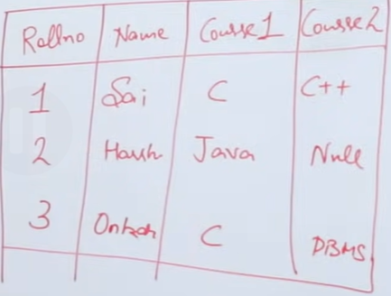

- By dividing into mutiple tables

  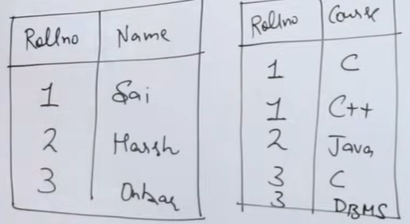

  In second table, primary-key will be combination of `rollno+course`


<br>
<br>

# Functional Dependency (FD)

A **Functional Dependency** describes a relationship between attributes in a relation.

It tells us that the value of one attribute (or set of attributes) can uniquely determine the value of another attribute.

It is written as:

```text
X → Y
```

Read as:

> `X` determines `Y`

Here:

- `X` = **Determinant**
- `Y` = **Dependent attribute**

### Example

```text
Student_ID → Student_Name
```

If we know `Student_ID`, we can uniquely find the `Student_Name`.

<br> 

## **Types of Functional Dependency**

## **1. Trivial Functional Dependency**

An FD `X → Y` is **trivial** when:

```text
Y ⊆ X
```

> Every attribute on the RHS is already present on the LHS.

### Examples

```text
AB → A
AB → B
ABC → AC
ABC → ABC
```

<br>

## **2. Non-Trivial Functional Dependency**

An FD `X → Y` is **non-trivial** when:

```text
Y ⊄ X
```

In simple words:

> At least one attribute on the RHS is not present on the LHS.

### Examples

```text
A → B
AB → C
ABC → D
```

<br>

## **3. Completely Non-Trivial FD**

An FD is **completely non-trivial** when there is no common attribute between LHS and RHS.

```text
X ∩ Y = ∅
```


<br>


## **Properties / Armstrong's Axioms**

| Property | Rule |
|---|---|
| Reflexivity | `Y ⊆ X ⇒ X → Y` trivial | 
| Augmentation | `X → Y ⇒ XZ → YZ` |
| Transitivity | `X → Y, Y → Z ⇒ X → Z` |
| Union | `X → Y, X → Z ⇒ X → YZ` |
| Decomposition | `X → YZ ⇒ X → Y, X → Z` |
| Pseudotransitivity | `X → Y, WY → Z ⇒ WX → Z` |

<br>
<br>

# Closure Method: 
Used to find All the candidate keys of a table from given fd.


## Terms

- **Attribute Closure (X⁺)**: everything we can find starting from X using the given FDs.

- **Candidate Key (CK)**: attribute through which we can find all other attributes of a table.

- **Super Key**: candidate-key + one or more extra-key.

- **Prime Attribute**: part of **at least one** candidate key.
- **Non-Prime Attribute**: **not part** of any candidate key.


## How to Find Closure

1. Write the starting set: `X⁺ = {X}`.
2. Pick any FD whose **left side is already inside** `X⁺`.
3. Add its **right side** to `X⁺`.
4. Repeat until nothing new can be added.


## Rules to Find Candidate Keys Faster

1. **Attribute never on the right side of any FD** → it must be in **every** candidate key. Start with it.
2. **Attribute only on the right side (never on the left)** → it is in **no** candidate key. Ignore it.
3. **Attribute on both sides** → it may or may not be in a key. Try it.
4. Take the must-have attributes and find their closure.
   - If closure = all attributes → that is a key.
   - If not → add one more attribute at a time and check again.
5. **Swap trick**: if an attribute of a key is produced by another attribute (for example `D → A`), try replacing it (`AE` → `DE`). Check the closure to confirm. This quickly gives the other keys.
6. Once a key is found, any bigger set containing it is only a **super key**, not a candidate key.
7. If there is **no must-have attribute**, check single attributes first, then pairs, then triples. Stop growing a set once its closure is complete.
8. If the FDs form a **cycle** (`A → B, B → C, C → D, D → A`), every attribute alone is a candidate key.


## Steps to Find Candidate Keys

1. List the attributes. Mark the ones **never on the right side** (must-have).
2. Find the closure of the must-have set.
3. If it is not complete, add other attributes one by one.
4. Use the swap trick to find more keys.
5. Keep only **minimal** sets that give all attributes.
6. Mark prime and non-prime attributes.

<br>

## Example 1:

**R(A, B, C, D)**
**FD = { A → B, B → A, A → C, C → D }**

**Closures**

```text
A⁺ = {A}
   → A → B : {A, B}
   → A → C : {A, B, C}
   → C → D : {A, B, C, D}   ✔ all attributes

B⁺ = {B}
   → B → A : {A, B}
   → A → C : {A, B, C}
   → C → D : {A, B, C, D}   ✔ all attributes

C⁺ = {C, D}                 ✘ A, B missing
D⁺ = {D}                    ✘ nothing new
```

**Candidate Keys** = `{A}`, `{B}`

**Super Keys** (not minimal, so not candidate keys): `{A,B}`, `{A,C}`, `{A,D}`, `{B,C}`, `{B,D}`, `{A,B,C}` ...

```text
{A, C}
  ↓ remove C
{A}  → already enough
```

**Prime** = {A, B}
**Non-Prime** = {C, D}

<br>

## Example 2:

**R(A, B, C, D, E)**
**FD = { A → B, BC → D, E → C, D → A }**

**Step 1: Must-have attribute**
E is never on the right side → E is in every key.

**Step 2: Closure of E**

```text
E⁺ = {E, C}      ✘ not enough
```

**Step 3: Add one attribute with E**

```text
AE⁺ : A → B gives B, E → C gives C, BC → D gives D
    = {A, B, C, D, E}   ✔ Key

DE⁺ : D → A gives A, A → B gives B, E → C gives C
    = {A, B, C, D, E}   ✔ Key   (swap trick: D gives A)

BE⁺ : E → C gives C, BC → D gives D, D → A gives A
    = {A, B, C, D, E}   ✔ Key   (swap trick: A gives B)

CE⁺ = {C, E}            ✘ Not a key
```

**Candidate Keys** = `{AE, DE, BE}`

**Prime** = {A, B, D, E}
**Non-Prime** = {C}

<br>

## Example 3: 

**R(A, B, C, D)**
**FD = { A → B, B → C, C → D, D → A }**

```text
A⁺ = {A, B, C, D}
B⁺ = {B, C, D, A}
C⁺ = {C, D, A, B}
D⁺ = {D, A, B, C}
```

Every single attribute gives all attributes.

**Candidate Keys** = `{A}`, `{B}`, `{C}`, `{D}`

**Prime** = {A, B, C, D}
**Non-Prime** = {} (empty)

<br>
<br>


# **2NF — Second Normal Form**
- Should be in 1nf
- There should not be any partial dependency. 
- Partial dependency occurs if non-prime attributes is determined by the part of a candidate key. It only occurs in case of composite candidate key.


Suppose table:

| Student_ID | Subject_ID | Student_Name | Subject_Name | Marks |
| ---------- | ---------- | ------------ | ------------ | ----- |
| 1          | S1         | Rahul        | DBMS         | 80    |
| 1          | S2         | Rahul        | OS           | 75    |
| 2          | S1         | Amit         | DBMS         | 90    |

Candidate Key: `(Student_ID, Subject_ID)`


### **Functional Dependencies**

```text
Student_ID → Student_Name
Subject_ID → Subject_Name
(Student_ID, Subject_ID) → Marks
```

### **Problem: Partial Dependency**
- `Student_Name` depends only on `Student_ID`.
- Therefore, `Student_Name` has a **partial dependency** on the composite candidate key `(Student_ID, Subject_ID)`.
- Similarly: `Subject_Name` depends only on `Subject_ID`.
- So, the table is **not in 2NF**.


<br>

## **Convert into 2NF**

To remove the partial dependencies, split the table into separate tables.


| Student_ID | Student_Name |
| ---------- | ------------ |
| 1          | Rahul        |
| 2          | Amit         |


| Subject_ID | Subject_Name |
| ---------- | ------------ |
| S1         | DBMS         |
| S2         | OS           |


| Student_ID | Subject_ID | Marks |
| ---------- | ---------- | ----- |
| 1          | S1         | 80    |
| 1          | S2         | 75    |
| 2          | S1         | 90    |

Now the dependencies are:

```text
Student_ID → Student_Name
Subject_ID → Subject_Name
(Student_ID, Subject_ID) → Marks
```
- `Marks` depends on the **complete candidate key**:

<br>
<br>

# **3NF (Third Normal Form)**
- Should be in 2nf
- There should not be any transitive dependency.
- A transitive dependency occurs when a non-prime attribute attribute depends on another non-prime attribute.
  ```text
  A → B
  B → C
  ```
  Therefore:

  ```text
  A → B → C
  ``` 
  Here, `C` indirectly depends on `A` through `B`.


## **Example**


| Student_ID | Student_Name | Dept_ID | Dept_Name  |
| ---------- | ------------ | ------- | ---------- |
| 1          | Rahul        | D1      | Computer   |
| 2          | Amit         | D2      | Mechanical |
| 3          | Priya        | D1      | Computer   |

Candidate Key: `Student_ID`

### **Functional Dependencies**

```text
Student_ID → Student_Name
Student_ID → Dept_ID
Dept_ID → Dept_Name
```

Here:

```text
Student_ID → Dept_ID
Dept_ID → Dept_Name
```

Therefore:

```text
Student_ID → Dept_Name
```

`Dept_Name` does not directly depend on `Student_ID`.

It depends on:

```text
Student_ID → Dept_ID → Dept_Name
```

This is a **transitive dependency**.

Therefore, the table is **not in 3NF**.

<br>

## **Convert into 3NF**

To remove the transitive dependency, split the table into two tables.


| Student_ID | Student_Name | Dept_ID |
| ---------- | ------------ | ------- |
| 1          | Rahul        | D1      |
| 2          | Amit         | D2      |
| 3          | Priya        | D1      |


| Dept_ID | Dept_Name  |
| ------- | ---------- |
| D1      | Computer   |
| D2      | Mechanical |

Now the dependencies are:

```text
Student_ID → Student_Name
Student_ID → Dept_ID

Dept_ID → Dept_Name
```

The transitive dependency has been removed from the Student table.

Therefore, the tables are in **3NF**.

<br><br>


# **BCNF (Boyce-Codd Normal Form)**
- Should be in 3nf.
- For every non-trivial functional dependency:
  ```text
  X → Y
  ```
  `X` must be a **super key**.


<br>

## **Example**

Consider:

```text
R(Student, Subject, Teacher)
```

Functional Dependencies:

```text
(Student, Subject) → Teacher
Teacher → Subject
```

Assume:

* A teacher teaches only one subject.
* A student can study a subject from a particular teacher.

### **Candidate Key**

`(Student, Subject)` can determine all attributes:

```text
(Student, Subject)+
= {Student, Subject, Teacher}
```

So:

```text
Candidate Key = {Student, Subject}
```

Therefore:

```text
Teacher → Subject
```

has `Teacher` as its determinant.

But:

```text
Teacher
```

is **not a super key** because it cannot determine `Student`.

So the FD:

```text
Teacher → Subject
```

violates the BCNF rule.

Therefore:

```text
R is NOT in BCNF
```

<br>

## **Convert to BCNF**

Split the relation into:


| Teacher | Subject |
| ------- | ------- |
| T1      | DBMS    |
| T2      | OS      |

FD:
`
Teacher → Subject
`

Here, `Teacher` is a key of this new relation.

 

| Student | Teacher |
| ------- | ------- |
| Rahul   | T1      |
| Amit    | T2      |

Now the violating dependency has been separated.

The resulting relations satisfy **BCNF**.


<br>
<br>


# BCNF & Dependency Preservation
- All normal forms up to 3NF are **dependency preserving**.
- BCNF is **not always dependency preserving** (some FDs may be lost).
- **Dependency preserving** = every original FD can be checked inside a single smaller table, without joining.

## Example

**R(Student, Subject, Teacher)**
**FD = { (Student, Subject) → Teacher, Teacher → Subject }**

- Candidate keys: `(Student, Subject)` and `(Student, Teacher)`
- `Teacher → Subject`: Teacher is not a super key → **violates BCNF**
- But Subject is a prime attribute → **R is in 3NF**

**Decompose into BCNF:**

```text
R1(Teacher, Subject)    → Teacher → Subject  ✔ kept
R2(Student, Teacher)
```

- **Lossless?** Common = `Teacher`, a key of R1 ✔
- **Dependency preserving?** `(Student, Subject) → Teacher` needs Student, Subject and Teacher together. No single table has all three ✘ **Lost**

So BCNF gave us a lossless split but lost one FD.

<br>
<br>


<br>

# **Joins** 
- A join **combines rows from two tables** using a related column (usually a key).
- Cross_product + some filter condition = Join

<br>

## Example
- **Employee**
    | dept_id | emp_name |
    |---------|----------|
    | 10 | Ravi |
    | 20 | Sita |
    | 30 | Amit |

- **Department**

    | dept_id | dept_name |
    |---------|-----------|
    | 10 | IT |
    | 20 | HR |
    | 40 | Sales |

<br>

## **Cross Join**
- Returns the **Cartesian product** of the two tables (every row of the first table combined with every row of the second table).

  ```sql
  SELECT *
  FROM Employee
  CROSS JOIN Department;
  ```

  | dept_id | emp_name | dept_id | dept_name |
  |---------|----------|---------|-----------|
  | 10 | Ravi | 10 | IT |
  | 10 | Ravi | 20 | HR |
  | 10 | Ravi | 40 | Sales |
  | 20 | Sita | 10 | IT |
  | 20 | Sita | 20 | HR |
  | 20 | Sita | 40 | Sales |
  | 30 | Amit | 10 | IT |
  | 30 | Amit | 20 | HR |


<br>

## **Inner Join**
- Returns only the rows that have **matching values** in both tables.

  ```sql
  SELECT *
  FROM Employee
  INNER JOIN Department
  ON Employee.dept_id = Department.dept_id;
  ```

  | dept_id | emp_name | dept_name |
  |---------|----------|-----------|
  | 10 | Ravi | IT |
  | 20 | Sita | HR |


<br>


## **Left Join**
- Returns **all rows from the left table**, and the matching rows from the right table. 

  ```sql
  SELECT *
  FROM Employee
  LEFT JOIN Department
  ON Employee.dept_id = Department.dept_id;
  ```

  | dept_id | emp_name | dept_name |
  |---------|----------|-----------|
  | 10 | Ravi | IT |
  | 20 | Sita | HR |
  | 30 | Amit | NULL | 

<br>


## **Right Join**
- Returns **all rows from the right table**, and the matching rows from the left table.

  ```sql
  SELECT *
  FROM Employee
  RIGHT JOIN Department 
  ON Employee.dept_id = Department.dept_id;
  ```

  | dept_id | emp_name | dept_name |
  |---------|----------|-----------|
  | 10 | Ravi | IT |
  | 20 | Sita | HR |
  | 40 | NULL | Sales |

<br>


## **Full Outer Join**
- Returns **all rows from both tables**, and fills in NULLs for missing matches.

  ```sql
  SELECT *
  FROM Employee
  FULL OUTER JOIN Department 
  ON Employee.dept_id = Department.dept_id;
  ```

  | dept_id | emp_name | dept_name |
  |---------|----------|-----------|
  | 10 | Ravi | IT |
  | 20 | Sita | HR |
  | 30 | Amit | NULL |
  | 40 | NULL | Sales |

<br>


## **Natural Join**
- Joins two tables **automatically on all columns that have the same name** in both tables.
- The common column appears **only once** in the result.

  ```sql
  SELECT *
  FROM Employee
  NATURAL JOIN Department;
  ```

  | dept_id | emp_name | dept_name |
  |---------|----------|-----------|
  | 10 | Ravi | IT |
  | 20 | Sita | HR |

<br>


## **Equi Join**
- Use this when tables have **more than one same-name column** and you want to join on only **one** of them.
- We explicitly specify the condition using `=`

  ```sql
  SELECT *
  FROM Employee, Department
  WHERE Employee.dept_id = Department.dept_id;
  ```

   | Employee.dept_id | emp_name | dept_name |Department.dept_id|
  |---------|----------|-----------|---------|
  | 10 | Ravi | IT | 10 |
  | 20 | Sita | HR | 20 |


<br>

 
## **Self Join**
- A table is joined **with itself**, using two different aliases (T1 and T2).
- Used when we need to compare **one row with another row of the same table**.

- **Example**

  | emp_id | name | manager_id |
  |--------|-------|------------|
  | 1 | Rahul | NULL |
  | 2 | Amit | 1 |
  | 3 | Priya | 1 |
  | 4 | Karan | 2 | 

  - Amit's `manager_id` = 1, and emp_id 1 is Rahul. So Amit's manager is Rahul.
  - Karan's `manager_id` = 2, and emp_id 2 is Amit. So Karan's manager is Amit.

  ```sql
  SELECT E.name AS employee, M.name AS manager
  FROM Employee E
  JOIN Employee M
    ON E.manager_id = M.emp_id;
  ```

  - `E` = the employee's information
  - `M` = the manager's information


  | employee | manager |
  |----------|---------|
  | Amit | Rahul |
  | Priya | Rahul |
  | Karan | Amit |

  Rahul has no manager (`NULL`),


<br>
<br>

# **Relational Algebra**
- A **query language** that uses operations to get data from tables .
- Each operation takes one or two tables as input and gives a **new table** as output.
- It is **procedural**: you tell *how* to get the result, step by step.
- It is the **theory behind SQL**. Every SQL query can be written in relational algebra.

## Operations

| Operation | Symbol | What it does |
|-----------|--------|--------------|
| Select | σ | Picks **rows** that satisfy a condition |
| Project | π | Picks **columns** |
| Union | ∪ | All rows from both tables (no duplicates) |
| Set Difference | − | Rows in the first table but **not** in the second |
| Cartesian Product | × | Every row of one table paired with every row of the other |
| Rename | ρ | Gives a new name to a table or column |
| Intersection | ∩ | Rows common to both tables |
| Join | ⋈ | Cross product + condition |
| Division | ÷ | Finds rows related to **all** rows of another table |

## Select (σ)
- Picks **rows** that satisfy a condition.
- The columns stay the same.

  **Student**

  | id | name | city |
  |----|------|------|
  | 1 | Rahul | Vadodara |
  | 2 | Amit | Surat |
  | 3 | Priya | Vadodara |

  ```text
  σ city='Vadodara' (Student)
  ```

  ```sql
  SELECT * FROM Student WHERE city = 'Vadodara';
  ```


## Project (π)
  - Picks **columns**.
  - Removes duplicate rows automatically.

    ```text
    π name (Student)
    ```

    ```sql
    SELECT DISTINCT name FROM Student;
    ```

    Result: Rahul, Amit, Priya.

    Together: `π name (σ city='Vadodara' (Student))` gives Rahul, Priya.

## Rename (ρ)
  - Gives a **new name(alias)** to a table or its columns.
  - Useful in self joins and for clear output.

    ```text
    ρ S (Student)
    ```

    ```sql
    SELECT * FROM Student AS S;
    ```

## Union (∪)
- Gives rows that are in the **first table, the second table, or both**. No duplicates.
- Both tables must be **union compatible**: same number of columns and same data types.

  ```text
  A ∪ B
  ```

  ```sql
  SELECT * FROM A
  UNION
  SELECT * FROM B;
  ```


## Intersection (∩)
- Gives rows that are in **both** tables.
- same number of columns and same data types.

  ```text
  A ∩ B
  ```

  ```sql
  SELECT * FROM A
  INTERSECT
  SELECT * FROM B;
  ```

 


## Set Difference (−)
- Gives rows that are in the **first table but not in the second**.
- same number of columns and same data types.
- Order matters: `A − B` is not the same as `B − A`.

  ```text
  A − B
  ```

  ```sql
  SELECT * FROM A
  EXCEPT
  SELECT * FROM B;
  ```


## Cartesian Product (×)
- Pairs **every row of the first table with every row of the second**.
- Rows in result = rows in first × rows in second.
- Columns in result = columns in first + columns in second.

  

  ```text
  A × B
  ```

  ```sql
  SELECT * FROM A, B;
  ```


## Join (⋈)
- **Join = Cross Product + Condition.**
- Keeps only the pairs that satisfy the condition.

  **Student**

  | id | name |
  |----|------|
  | 1 | Rahul |
  | 2 | Amit |
  | 3 | Priya |

  **Marks**

  | id | marks |
  |----|-------|
  | 1 | 80 |
  | 2 | 90 |

  ### **Theta Join**
    - Condition can use any operator: `=`, `<`, `>`, `<>`.

      ```text
      Student ⋈ Student.id = Marks.id (Marks)
      ```

      ```sql
      SELECT * FROM Student JOIN Marks ON Student.id = Marks.id;
      ```

  ### **Equi Join**
  - A theta join where the condition uses only `=`.
  - The common column appears twice.

  ### **Natural Join**
  - Joins automatically on the same-name columns.
  - The common column appears once.

    ```text
    Student ⋈ Marks
    ```

    ```sql
    SELECT * FROM Student NATURAL JOIN Marks;
    ```

    | id | name | marks |
    |----|------|-------|
    | 1 | Rahul | 80 |
    | 2 | Amit | 90 |

    Priya has no marks, so she is left out.

  ### **Outer Joins**
  - Keep the rows that have no match, and fill with `NULL`.

    | Type | Symbol | Keeps |
    |------|--------|-------|
    | Left Outer | ⟕ | All rows of the left table |
    | Right Outer | ⟖ | All rows of the right table |
    | Full Outer | ⟗ | All rows of both tables |

    ```sql
    SELECT * FROM Student LEFT JOIN Marks ON Student.id = Marks.id;
    ```

    Priya appears with `marks = NULL`.


## Division (÷)
- Used to find rows in one table that are related to **all rows** of another table.
- Scenario: Find students who are enrolled in **all courses**.

**Enroll**

| student | course |
|---------|--------|
| Rahul | C1 |
| Rahul | C2 |
| Amit | C1 |

**Course**

| course |
|--------|
| C1 | 
| C2 |

```text
Enroll ÷ Course
```

Result: Rahul (he is enrolled in both C1 and C2). Amit only has C1, so he is left out.


<br>
<br>

# **SQL**

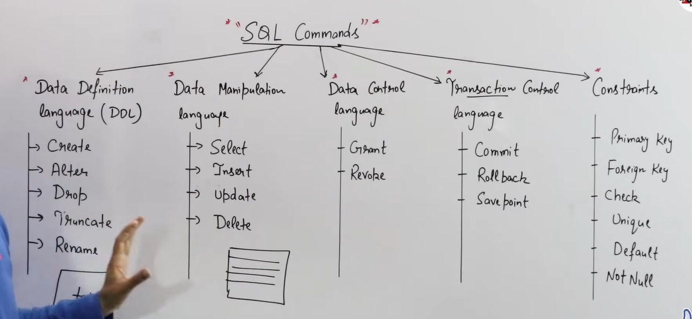

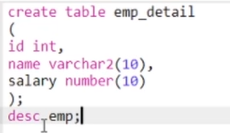

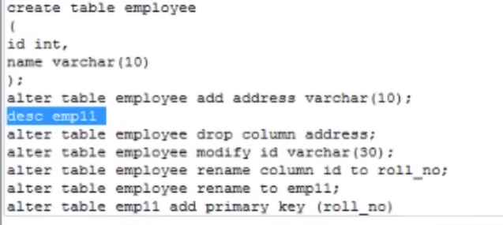


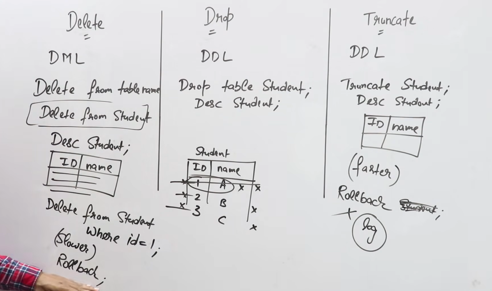

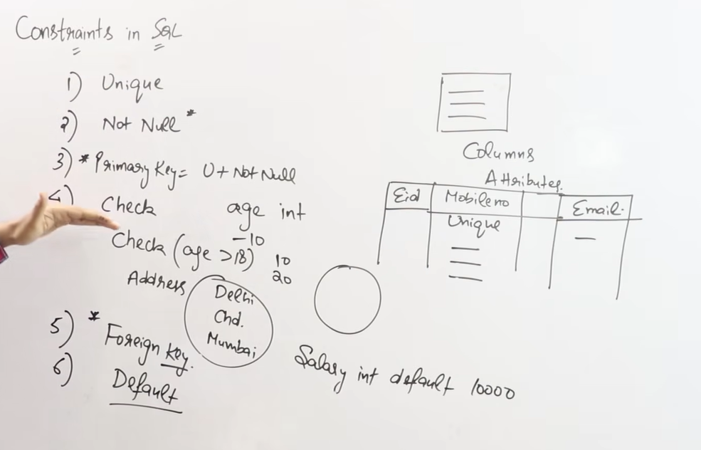 


<br>
<br>

# Subqueries
- It's a query **inside another query**. 
- Executed first once, and its result is used by the outer query.

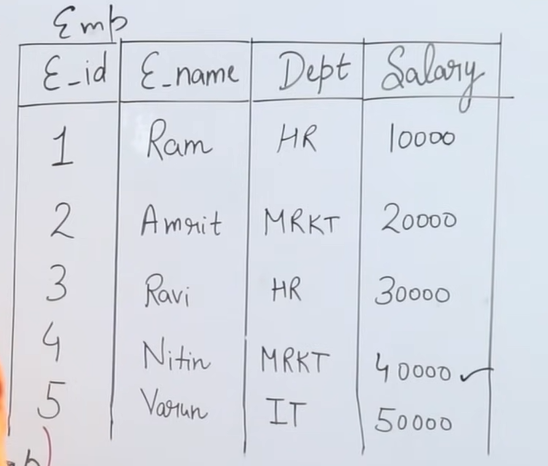

### Name of employee with the **highest salary**:
```sql
SELECT name FROM employees WHERE salary = (SELECT MAX(salary) FROM employees);
```

### Second highest salary:
```sql
SELECT MAX(salary) FROM employees WHERE salary < (SELECT MAX(salary) FROM employees);
```

<br>

## **`Group By`**
- Groups rows that have the same values in specified columns into **summary rows**.
- We can only select the attributes that are in the `GROUP BY` clause or **aggregated** (like `COUNT`, `SUM`, `AVG`, etc.).

  ### Write query to find number of employees in each department:
  ```sql
  SELECT department, COUNT(*) AS employee_count FROM employees GROUP BY department;
  ```
 
  ### Query to find name of emloyee where number of employees in that employee's department < 2:
  ```sql
  SELECT name FROM employees WHERE department IN (
      SELECT department FROM employees GROUP BY department HAVING COUNT(*) < 2 );
  ```


  ### Write a query to display highest salary department wise and name of employee who is taking that salary.
  ```sql
  SELECT department, name, salary FROM employees WHERE (department, salary) IN (
      SELECT department, MAX(salary) FROM employees GROUP BY department
  );
  ```

<br>

## **`with` clause**
- Used to store the result of a subquery in a temporary table (CTE — Common Table Expression) that can be referenced multiple times in the main query.

  ### Name of employee with the **highest salary**:
    ```sql
    WITH max_salary AS (
        SELECT MAX(salary) AS salary FROM employees
    )
    SELECT name FROM employees, max_salary
    WHERE employees.salary = max_salary.salary;
    ```

<br>

## **in / not in**
-  used to check if a value is present in a list of values or not.
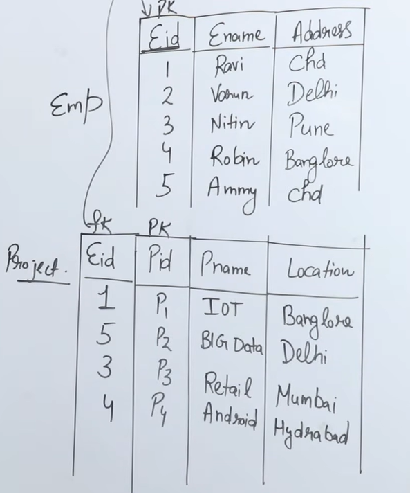

### Detail of employees whose address is either delhi or mumbai:
```sql
SELECT * FROM employees WHERE address IN ('delhi', 'mumbai');
```


### Name of employee who are working on a project.
```sql
SELECT name FROM employees WHERE Eid IN (SELECT DISTINCT Eid FROM projects);
```

<br>

## **`exists` / `not exists`**
- Used to check if a subquery returns any rows or not.
- Here, each row of the outer query is checked against the result of the inner query.
- Inner query is executed **once for each row** of the outer query.
- Also called as **correlated subquery**.
- The inner query refers to a column from the outer query.

### Detail of employees who are working on at least one project.
```sql
SELECT * FROM employees WHERE Eid EXISTS (SELECT Eid FROM projects WHERE projects.Eid = employees.Eid);
```

### Find employees whose salary is greater than the average salary of their own department:
```sql
SELECT e.name, e.salary, e.dept_id
FROM employee e
WHERE e.salary > (
    SELECT AVG(e2.salary)
    FROM employee e2
    WHERE e2.dept_id = e.dept_id
);
```

<br> 

## **`any` / `all`**
- Used to compare a value with a set of values returned by a subquery.
- Only works with **comparison operators** (`=`, `!=`, `<`, `>`, `<=`, `>=`).

### Name of employee whose salary is greater than **any** employee in department 10:
```sql
SELECT name FROM employees WHERE salary > ANY (SELECT salary FROM employees WHERE department = 10);
```

<br>

## **like / not like**
- Used to search for a specified pattern in a column.
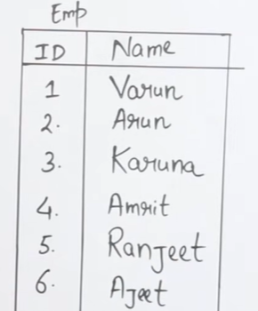

### Find the name of employee whose name starts with 'A':
```sql
SELECT name FROM employees WHERE name LIKE 'A%';
```

### Find the name of employee whose name ends with 'a':
```sql
SELECT name FROM employees WHERE name LIKE '%a';
```

### Find the name of employee whose second letter is 'a':
```sql
SELECT name FROM employees WHERE name LIKE '_a%';
```

<br>

## **Sequences in SQL**
- Its  a database object used to generate unique numbers automatically, usually for IDs.
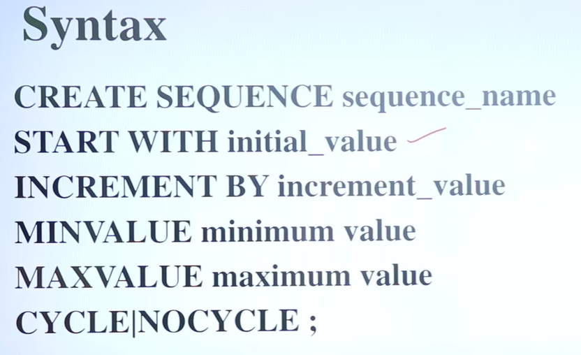
  - If nocycle is specified, the sequence will stop generating numbers when it reaches the maximum value.

## Inserting into a table with a sequence:
```sql
INSERT INTO employees (Eid, name, salary) VALUES (employee_seq.NEXTVAL, 'John Doe', 50000);
```


<br>

## How SQL Queries are executed?
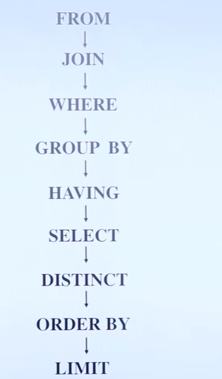
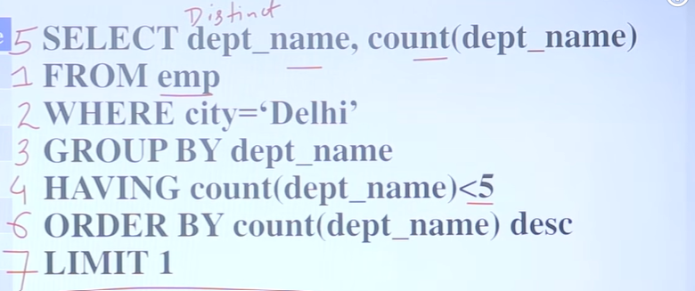


<br>

## **Aggregate Functions**
- Aggregate functions perform a calculation on a set of values and return a single value.
- All aggregate functions **ignore NULL values** except `COUNT(*)`.
- If all values of a column are null then all aggregate functions will return `NULL` except `COUNT(*)` which will return `0`.


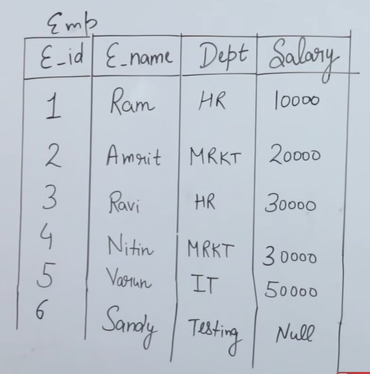

### Print number of rows in employees table:
```sql
SELECT COUNT(*) FROM employees; 
```
- Output will be `6` null will be included in the count.

## Print number of employee getting salary.
```sql
SELECT COUNT(salary) FROM employees;
```
  - Output will be `5` null be excluded from the count.


### Print number of distinct salary in employees table:
```sql
SELECT COUNT(DISTINCT salary) FROM employees;
```

<br>
<br>

# Transactions in SQL
- Group of database operations that should be treated as one complete unit of work.
- It follow `ACID` properties.
  - `Atomicity`:	Either all operations happen, or none happen
  - `Consistency`:	Database remains valid (Before transaction and after transaction sume of all values will be same)
  - `Isolation`:	Transactions don't interfere incorrectly with each other (converting parallel transactions into serial transactions)
  - `Durability`:	Once committed, changes are not lost
- Operations in a transaction are **not permanent** until the transaction is **committed**.


<br>
 
## How transaction works?
-  Data is read from the disk into **RAM (buffer/cache)** so the database can work on it efficiently.
- Most read/write operations are performed through the database's **memory/buffer cache**.
- During a transaction, changes are **not considered committed yet**, even if some modified data is written to disk.
- The database keeps the necessary information (such as undo/transaction information) to **undo uncommitted changes**.
- When the transaction is **COMMITTED**, its changes become permanent.
- When the transaction is **ROLLED BACK**, the database uses this information to undo the transaction's changes and restore the previous state.
- `COMMIT` and `ROLLBACK` describe the **transaction state**, not simply whether the data is currently in RAM or on disk.

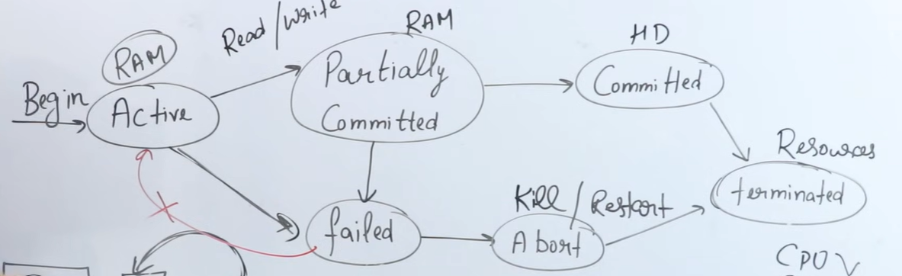

<br> 

## Transaction Control Commands
| Command | Description |
|---------|-------------|
| BEGIN TRANSACTION | Starts a new transaction |
| COMMIT | Saves the changes made in the current transaction |
| ROLLBACK | Undoes the changes made in the current transaction |
| SAVEPOINT | Creates a point within a transaction to which you can roll back |


<br>
<br>

# Schedule
- Execution order of operations from multiple transactions.

### Serial Schedule
- A schedule is **serial** if all operations of one transaction are executed before the operations of the next transaction.
- High waiting time. 


### Parallel Schedule
- A schedule is parallel if operations of multiple transactions are interleaved. 
- High throughput. But may lead to **inconsistency** if not handled properly.

<br>

## Types of problems in parallel schedule
### Dirty Read: 
- One transaction reads data that another transaction has changed but not committed yet.
  ```
  Transaction A: Change salary 50,000 → 70,000
                          ↓
  Transaction B: Reads 70,000
                          ↓
  Transaction A: ROLLBACK
                          ↓
  Actual salary = 50,000
  ```
  B read temporary/invalid data.


### Incorrect Summary

- One transaction is calculating a total/average, while another transaction is changing the data at the same time.
  ```
  Account A = 1000
  Account B = 2000

  Transaction A starts calculating total
  → reads A = 1000

  Transaction B changes B
  → B = 3000

  Transaction A reads B = 3000

  Total calculated = 4000
  ```

### Lost Update
- Two transactions read the same value and both update it.
  ```
  Initial stock = 10

  Transaction A reads 10
  Transaction B reads 10

  A changes → 10 - 2 = 8
  B changes → 10 - 3 = 7

  Final value = 7
  ```

  A's update (8) was lost.

### Unrepeatable Read
- A transaction reads the same row twice, but gets different values because another transaction changed it in between.
```
Transaction A: Reads salary = 50,000

Transaction B: Changes salary = 60,000
Transaction B: COMMIT

Transaction A: Reads salary again
               = 60,000
```

### Phantom Read
- A transaction runs the same query twice, but the number of rows changes because another transaction inserted/deleted rows. 
  ```
  SELECT *
  FROM employee
  WHERE salary > 50000;
  ```
  First time: `2 employees`

  Another transaction inserts an employee with salary `70000`.

  Second time:`3 employees`

  The new row is called a `phantom row`.